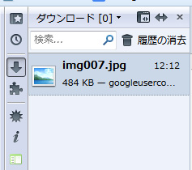

いつだかからFirefoxでダウンロードマネージャが新しくなり、なんでもかんでもAll in One Sidebarにぶち込んでる俺といたしましては、サイドバーに表示しようと思っても別ウィンドウで出てきやがったりするのでとてつもなく不便でございました。しかし解決策があったのでメモ。

about:configを開き、

```
browser.download.useToolkitUI
```

をtrueにするだけで終わり



これで充実したサイドバーライフに
