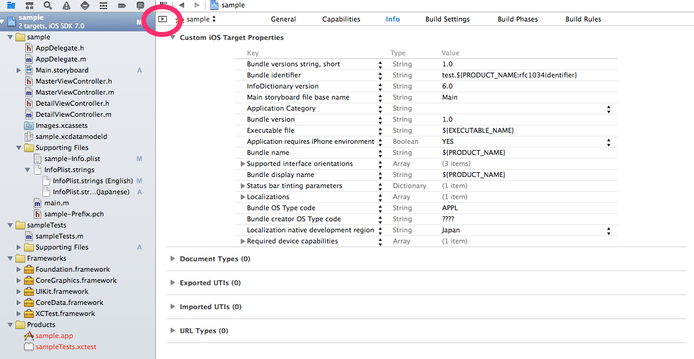

Xcode5でローカライズしようと思ったけど、ローカライズできなくていろいろと悩んだのでメモ。  
 Xcode4までと設定が変わった？（というか自分の設定ミスかも）。  
 プロジェクト名をクリックし、Localizationの部分にjapaneseを追加するだけなんだけど、どこにもLocalizationが表示されてなくて焦った。

環境はOS X Mavericks  
 Xcode5.01（5.02でも検証済みです。）

上の丸部分をクリックすると現れるのであった。ちゃんちゃん。

あとはLocalize native development regionにJapanを追加でおｋ（もしくはシミュレータの環境設定で日本語にする）。  
 これでXcode5環境でのローカライズは完了です。
