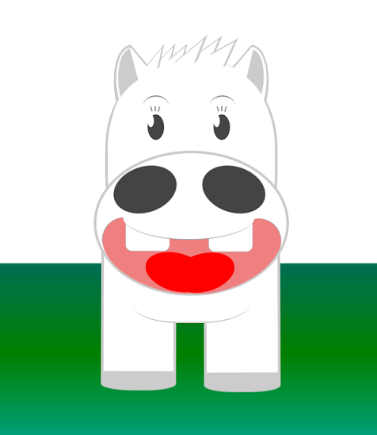

馬といえばマキバオーなので、CSS3とSASSの復習がてらCSS3で迫り来るマキバオーを作った。

SASSのコードを置いておきます。（途中から飽きたのでコードがひどいのはご愛嬌。）   
 作業時間は3～4時間ほど。HTMLのサイズが2k、CSSが9kなのでやっぱ画像より軽いっすね。   
 がんばればもうちっと圧縮できそうだけどもうやりたくはないなｗ

## 頑張ったとこ

耳と髪（毛）が難しかった。CSSでパスが描けるようになると非常に楽なんだけどなあ。そもそもjsでやれよという話なんだろうけど。

## ハマったとこ

- @keyframes。sassでアニメーションしたことなかったので、@keyframesをネスト内でやるとハマる。
- グラデーション部分。本当はグラデーションで立体感を出したかったんだけど、ベンダープレフィックスが面倒くさいのと、最近フラットが流行ってるのでwebkit環境の背景だけにしました（言い訳）

```scss
$CANVAS_WIDTH: 600px;
$CANVAS_HEIGHT: 700px;
$HEAD_WIDTH: 264px;
$BOTTOM_WIDTH: 300px;
$MOUTH_HEADER_WIDTH: 208px;
$EYE_WIDTH: 26px;

$HEAD_DEFAULT: 100px;

body {
    -webkit-text-size-adjust: 100%;
    width:100%;
}

#makibaoo {
    width: $CANVAS_WIDTH;
    height: $CANVAS_HEIGHT;
    border: 1px solid #ccc;
    position: relative;
    background:-webkit-gradient(linear, center top, center bottom, from(#fff), color-stop(0.6, #fff),color-stop(0.6, #006e54), color-stop(0.8, green), to(#00a381));

    .head-top div,.head-bottom div, .body div {
        position: absolute;
    }
}

.head-top {

    .head-main {
        width: $HEAD_WIDTH;
        height: 351px;
        background: #fff;
        border-color: #ccc;
        border-radius: 63% 63% 80% 80%;
        border-style: none solid none solid;
        border-width: 4px;
        top: $HEAD_DEFAULT;
        left: ($CANVAS_WIDTH - $HEAD_WIDTH) * 0.5;
    }

    .ear, .ear:after,.ear-inner, .ear-inner:after, .ear-inner2, .ear-inner2:after {
        width: 40px;
        height: 90px;
        background: #ccc;
        border-left: 4px solid #ccc;
        border-radius: 0 0 72px / 0 0 148px;
        border-top: 1px solid #ccc;
        top: 77px;
        left: 199px;
        transform: rotate(140deg);
    }

    .ear.right {
        left: 388px;
        transform: scale(-1,1) rotate(166deg);
    }

    .ear.right:after {
        top: -7px;
        left: -28px;
        transform: rotate(-387deg);
    }

    .ear-inner {
        background: #fff;
        border-left: 4px solid #fff;
        border-top: 1px solid #fff;
        top: 74px;
        left: 197px;
        transform: rotate(140deg) scale(0.85);
        z-index: 90
    }

    .ear-inner2, .ear-inner2:after {
        background: #ccc;
        border-left: 4px solid #fff;
        border-top: 1px solid #fff;
        top: 75px;
        left: 180px;
        transform: rotate(-15deg) scale(-0.85,-0.85);
        z-index: 99
    }

    .ear-inner2:after {
        content:"";
        position: absolute;
        top: -58px;
        left: -238px;
        transform: rotate(-152deg) scale(0.85,-0.85);
        z-index: 99
    }


    .ear-inner.right {
        top: 73px;
        left: 387px;
        transform: scale(-0.85,0.85) rotate(167deg);
    }

    .ear-inner.right:after {
        top: -7px;
        left: -28px;
        transform: rotate(-387deg);
    }

    .ear:after, .ear-inner:after {
        content: "";
        position: absolute;
        top: 14px;
        left: 14px;
        transform: rotate(-334deg);
    }

    .ear-inner:after {
        background: #fff;
        border-left: 4px solid #fff;
        border-radius: 0 0 72px / 0 0 148px;
        border-top: 1px solid #fff;
        z-index: 99
    }

    .ear-over, .ear-over:after {
        width: 100px;
        height: 50px;
        background: #fff;
        border-radius: 50%;
        top: 137px;
        left: 169px;
        z-index: 99;
        transform: rotate(-48deg);
    }

    .ear-over:after{
        content:"";
        position: absolute;
        top: 107px;
        left: 118px;
        transform: rotate(88deg);
    }

    .fur,.fur:after,.fur:before {
        width: 34px;
        height: 15px;
        background: #fff;
        border-left: 4px solid #ccc;
        border-radius: 0 0 62px / 0 0 24px;
        border-top: 1px solid #ccc;
        top: 97px;
        left: 240px;
        transform: scale(-1.1, 1.3) rotate(41deg) skew(57deg);
        z-index: 6;
    }

    .fur.second{
        top: 88px;
        left: 302px;
        transform: scale(-1.5, 1.5) rotate(35deg) skew(58deg);
    }

    .fur:after {
        content: "";
        position: absolute;
        top:-9px;
        left: 23px;
        transform:rotate(5deg);
        z-index: 6;
    }

    .fur:before {
        content: "";
        position: absolute;
        top: 9px;
        left: -34px;
        transform: rotate(-5deg);
        z-index: 6;
    }

    .eyeblow {
        width: 40px;
        height: 30px;
        border-color: #999999;
        border-radius: 50%;
        border-style: solid none none none;
        border-width: 2px;
        top: $HEAD_DEFAULT + 53px;
        left: ($CANVAS_WIDTH * 0.5) - 72px;
        z-index: 200
    }

    .eyeblow.right {
        left: ($CANVAS_WIDTH * 0.5) + 33px;
    }

    .eyeslash {
        width: 5px;
        height: 8px;
        border-color: #999999;
        border-style: none solid none none;
        border-width: 2px;
        top: $HEAD_DEFAULT + 70px;
        left: ($CANVAS_WIDTH * 0.5) - 59px;
        z-index: 200
    }


    %eyeslash{
        content: "";
        width: 5px;
        height: 8px;
        position: absolute;
        border-color: #999999;
        border-style: none solid none none;
        border-width: 2px;
    }

    .eyeslash:after {
        @extend %eyeslash;
        transform: rotate(15deg);
        left: 6px;
    }

    .eyeslash:before {
        @extend %eyeslash;
        transform: rotate(-15deg);
        top: 1px;
        left: -6px;
    }

    .eyeslash.right {
        left: ($CANVAS_WIDTH * 0.5) + 66px - 20px;
    }

    .eye {
        width: $EYE_WIDTH;
        height: 40px;
        background: #444;
        border-radius: 50%;
        top: $HEAD_DEFAULT + 83px;
        left: ($CANVAS_WIDTH * 0.5) - 65px;
    }

    .eye:after {
        content: "";
        width: 10px;
        height: 20px;
        position: absolute;
        background: #fff;
        border-radius: 50%;
    }

    .eye.right {
        left: ($CANVAS_WIDTH * 0.5) + 65px - $EYE_WIDTH;
    }
}


.head-bottom {

    .bottom-main {
        width: $BOTTOM_WIDTH;
        height: 220px;
        background: #fff;
        border: 4px solid #ccc;
        border-radius: 50%;
        top: $HEAD_DEFAULT + 140px;
        left: ($CANVAS_WIDTH - $BOTTOM_WIDTH) * 0.5;
        z-index: 25
    }

    .nose-hole {
        width: 100px;
        height: 70px;
        background: #444;
        border: 1px solid #444;
        border-radius: 50%;
        top: $HEAD_DEFAULT + 165px;
        left: ($CANVAS_WIDTH * 0.5) - 120px;
        transform: rotate(-18deg);
        z-index: 90;
    }

    .nose-hole.right{
        left: ($CANVAS_WIDTH * 0.5) + 20px;
        transform: rotate(18deg);
    }

    .tongue {
        width: 100px;
        height: 90px;
        position: relative;
        top: $HEAD_DEFAULT + 289px;
        left: ($CANVAS_WIDTH * 0.5) - 110px;
        z-index: 50;
        }

    .tongue:before,
    .tongue:after {
        content: "";
        width: 100px;
        height: 60px;
        position: absolute;
        top: 0;
        left: 50px;
        background: red;
        border-radius: 50%;
        transform: rotate(15deg);
        transform-origin: 0 0 0;
    }
    .tongue:after {
        transform: rotate(-15deg);
        transform-origin :115% -150% 0;
    }

    .mouth-header {
        width: $MOUTH_HEADER_WIDTH;
        height: 71px;
        background: #FFFFFF;
        border-color: #999999;
        border-radius: 50%;
        border-style: none none solid;
        border-width: 1px;
        top: $HEAD_DEFAULT + 208px;
        left: ($CANVAS_WIDTH - $MOUTH_HEADER_WIDTH)*0.5;
        transform: rotate(0deg);
        z-index: 60;
    }

    %mouth_default{
        width: 70px;
        height: 40px;
        background: #f08080;
        border-color: #999999;
        border-radius: 85px 85px 0 0;
        border-style: solid none none none;
        border-width: 1px;
        z-index: 40;
    }

    .mouth-left {
        @extend %mouth_default;
        top: $HEAD_DEFAULT + 253px;
        left: ($CANVAS_WIDTH * 0.5) - 150px;
        transform: rotate(-65deg);
    }

    .mouth-right {
        @extend %mouth_default;
        top: $HEAD_DEFAULT + 255px;
        left: ($CANVAS_WIDTH * 0.5) + 89px;
        transform: rotate(65deg);
    }

    .mouth-right:before, .mouth-right:after {
        width: 190px;
        height: 100px;
        background: #f08080;
        border-radius: 50%;
        content: "";
        position: absolute;
        top: 3px;
        left: 89px;
        transform: rotate(93deg);
        transform-origin: 0 0 0;
        z-index: 45
    }

    .mouth-right:after {
        width: 195px;
        left: -5px;
        top: -8px;
        transform: rotate(-46deg);
        transform-origin: 110% 236% 0;
    }

    %tooth_default{
        width: 68px;
        height: 80px;
        background: #fff;
        border: 1px solid #ccc;
        border-radius: 10px;
        z-index: 45;
    }

    .tooth{
        @extend %tooth_default;
        left: ($CANVAS_WIDTH * 0.5) - 100px;
        top: $HEAD_DEFAULT + 216px;

    }

    .tooth:after{
        content: "";
        position: absolute;
        @extend %tooth_default;
        left: 130px;
    }

}


.body{

    .body-main{
        width: 185px;
        height: 76px;
        background: #fff;
        border: 2px solid #ccc;
        border-radius: 108% 139% 102% 94%;
        border-style: none none solid none;
        top: 433px;
        left: 212px;
        z-index:14;
    }

    .foot{
        width: 106px;
        height: 232px;
        background: #fff;
        border: 4px solid #ccc;
        border-style: none solid solid solid;
        top: 350px;
        left: 164px;
        transform: scale(1,1.05) skew(2deg);
        animation: 'anime1' 1s linear -1s infinite alternate;
        -moz-animation: 'anime1' 1s linear -1s infinite alternate;
    }


    .foot.right{
        left: 327px;
        transform: scale(1,1.05) skew(-2deg);
        animation: 'anime2' 1s linear -1s infinite alternate;
        -moz-animation: 'anime2' 1s linear -1s infinite alternate;
    }

    .foot:after{
        content: "";
        position: absolute;
        width: 106px;
        height: 22px;
        position: absolute;
        background: #ccc;
        border: 4px solid #ccc;
        border-radius: 0% 0% 40% 40%;
        border-style: none solid solid solid;
        top: 235px;
        left: -4px;
    }
}

@keyframes anime1 {
  0% {
    transform: scale(1) rotate(1deg);
  }
  100% {
    transform: scale(1.1) rotate(-1deg);
  }
}


@keyframes anime2 {
  0% {
    transform: scale(1.1) rotate(-1deg);
  }
  100% {
    transform: scale(1) rotate(1deg);
  }
}
```
