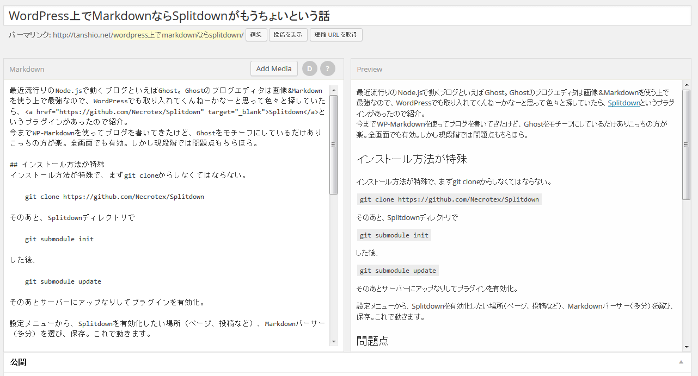
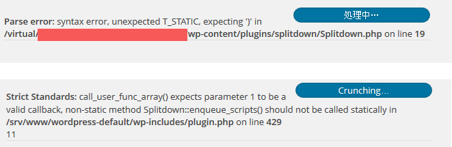

最近流行りのNode.jsで動くブログといえばGhost。Ghostのブログエディタは画像&Markdownを使う上で最強なので、WordPressでも取り入れてくんねーかなーと思って色々と探していたら、[Splitdown](https://github.com/Necrotex/Splitdown)というプラグインがあったので紹介。   
 今までWP-Markdownを使ってブログを書いてきたけど、Ghostをモチーフにしているだけありこっちの方が楽。全画面でも有効。しかし現段階では問題点もちらほら。

投稿画面は上記のような感じ。

## インストール方法が特殊

インストール方法が特殊で、まずgit cloneからしなくてはならない。

 [crayon-52f106e5ab32b034730231/] そのあと、Splitdownディレクトリで

 [crayon-52f106e5ab33a067592035/] した後、

 [crayon-52f106e5ab343387750160/] そのあとサーバーにアップなりしてプラグインを有効化。

設定→投稿設定メニューから、Splitdownを有効化したい場所（ページ、投稿など）、Markdownパーサー（多分）を選び、保存。これで動きます。

## 問題点

### エラーが出まくる

ここはcoreserverで動いているのですが、cgiモードじゃないと動きませんでした。

 [crayon-52f106e5ab34d250148660/] また、ローカル環境でも動くことは動くのですが、Strictだとエラーが出まくる。よくわからん。

### 画像がアップできない

とりあえずローカルでもサーバー上でも画像がアップできなくなりました。4つのサーバーでダメだということはそういうことなんでしょう。アップ済みのものは埋め込めますが、サムネイルでは埋め込めない感じ。

### スクロールされない

長い文章書いているとスクロールしてほしいもんなんですがまだ実装されていない模様。

### 謎の空白行&コード埋め込むのがめんどい

コードはスペース4つかタブなのですが、タブだと違うところに行っちゃうのでスペース4つのみ。`でくくれるようにしてくれ。スペース4つだと、上記のように空白行が登場します。

## まとめ

公式プラグインサイトにアップされるのを待ちながら非常に楽なのでわたくしはこれを使います。先日wordpress.comではMarkdownでブログ書けるようになったみたいなんで、いつかデフォルトで書けるようになってほしいっすわ＼(^o^)／（evernoteもたのんます）evernoteもたのんます）
