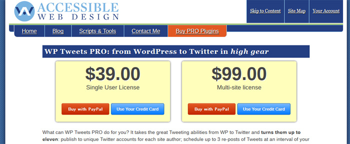
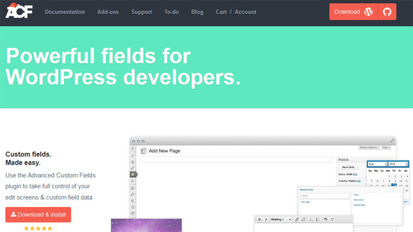

WordPressは膨大な数の無料プラグインで成り立っていると言っても過言ではありません。 無料プラグインを紹介している所はたくさんありますが、有料プラグインを紹介している所は少ないので、私のいろんな経験から本当に使えるプラグインを3つだけ紹介します。

## Gravity Forms

WordPressのフォームといえばContact form 7。Contact Form 7を使わない場合はメールフォームプロというのが最近の定番ですが、フォームをバンバン作ったり、カスタマイズしたメールフォームを作りたい！という時にはGravity Formsがお勧めです。

### Gravity Formsの凄い所

何ができるのかって言われると何でもできるフォームとしか言い様がないのですが、本当に大体なんでもできます。クイズを作れたり、PayPalと連携して決済まで出来たり、そこからTwilloを用いてSMSまで送信できたり、フォームの範疇を超えて活躍してくれます。

### Gravity Formsの価格

価格は**39～199$**  
 年単位ですがあんまり関係ないです。

## WP Tweets Pro

WordPressとTwitterを連携するときの万能プラグインといえばWP To Twitter。その有料版がWP Tweets Proです。

### WP Tweets Proの凄い所

大体は無料版の機能で事足りるのですが、わたくし的にどうしても付けたかった機能が画像の添付です。これに対応している無料プラグインがない。概要に画像をつけたりするのはTwitter:cardsをメタタグ埋め込むだけなんで簡単なんですが、スマホ用のTwitterクライアントでTwitter:cardsがそこまで普及していない、概要をクリックしてくれないと見られない現状、WP Tweets Proを主に使っています。カスタムタクソノミーなどでフィルタがかけられる、スケジュール機能などがあるのも便利です。

### WP Tweets Proの価格

価格は**39、199$**の2種類   
 私は複数のサイトがあるので99$の方を購入しました。

## Advanced Custom Fields

いつのまにか登場してカスタムフィールド界の帝王に君臨したのがこのAdvanced Custom Fields。ご存じの方も多いのではないでしょうか。基本的に無料なのですが、繰り返しフィールド、柔軟コンテンツフィールド、ギャラリーフィールド、オプションページという4つの有料プラグインがもうとんでもない凄さ。通常版でも革命的なのですが、この4つを購入するだけでもうテーマなどの開発、クライアントへの受け渡しがかなり楽に行えます。

### Advanced Custom Fieldsの凄い所

無料版でも十分に凄いので、そこは他のブログやサイトに任せるとして、ここでは有料プラグインの凄さを紹介します。

#### 繰り返しフィールド

カスタムフィールドを、繰り返して活用させることができるカスタムフィールドを作れるプラグインです。 何言っているかわからないと思いますが、クライアントサイドで本当に使えます。

例えば、何かしらの商品の場合は 「商品名、値段、サイズ」といった決まった枠組みがあると思います。そのテンプレートが作れる感じです。上の3つのフィールドを1グループとし繰り返せるのが繰り返しフィールドの能力です。

#### 柔軟コンテンツフィールド

繰り返しフィールドと両方あると便利なのがこの柔軟コンテンツフィールド。 決まった複数の枠組みをテンプレートと化し、ユーザーに選択させることで柔軟にコンテンツが作成できます。もちろん繰り返しフィールドも。最初は繰り返しフィールドで事足りんじゃんとか思ってましたけど、使うとほんとうに便利です。右左とかいうレイアウトなどを作っておいて、後は投稿者に選択させ、レイアウトを柔軟に組み立てられるのが柔軟コンテンツフィールドの能力です。

#### ギャラリーフィールド

WordPressのデフォルトになってもおかしくないのがこのギャラリーフィールド。 画像は自由自在に順番変えられるし、キャプション等も簡単に変更可能だしでもう早くデフォルトで採用されて欲しいレベルなのがギャラリーフィールドの能力です。

#### オプションページ

オプションのページを作れるというそのままのプラグインがオプションページ。 例えばスライダーとかをクライアントに更新してほしい時などに、オプションページを用いれば簡単に作成が可能です。 今までは自分でプラグインを作るか、プラグインを導入しなくてはいけないものが解決できる（かも）というパワーを秘めたのがオプションページの能力です。

（WelcartでAdvanced Custom Fieldsが何をどうしても動かないのがめちゃくちゃ痛い。）

### Advanced Custom Fieldsoの価格

価格は1プラグイン**25$**の4種類   
 全部購入しても100$なので安い。

## まとめ

今回紹介したプラグインは全部素晴らしいプラグインばかりなのでお勧めです。

ぶっちゃけ、無料でやろうとしてもダメなときはお金で解決が可能な場合のほうが多いので、有料プラグインを購入したほうが時間の短縮にもなります。

無料でできることが多いのがWordPressのメリットとも言えますが、それもプラグインの開発者や、WordPressの開発者のお陰です。私は12月を寄付月と称してお酒代を寄付代へと変換し、開発者の飲み代へと還元しています。みんながそうしろというわけでもないですが、できるだけ無料プラグインの開発者へありがとうという気持ちを忘れないでいたいですね。（小並感）
