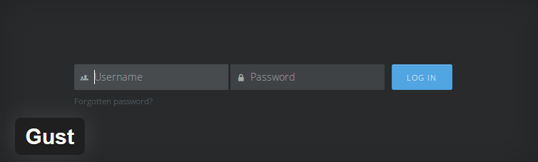
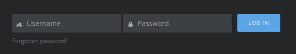
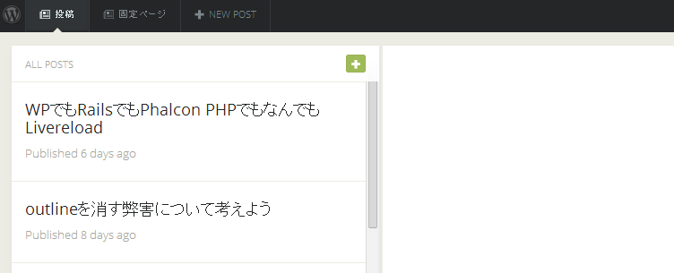
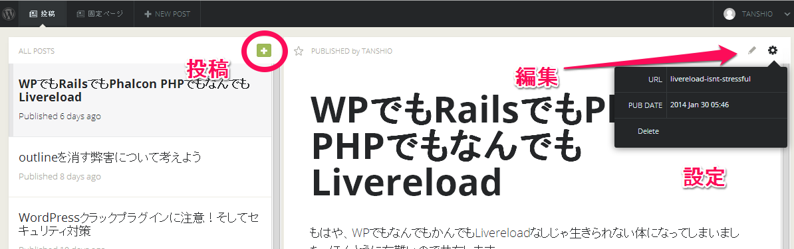
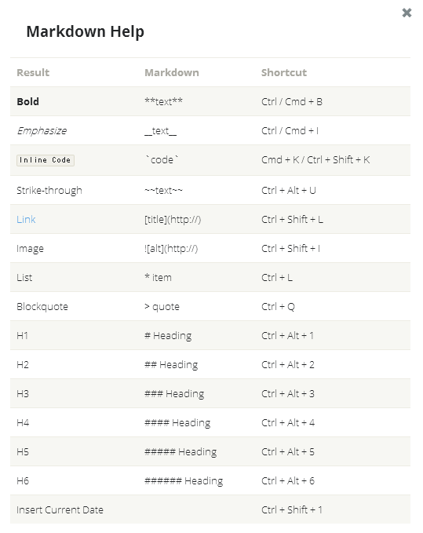
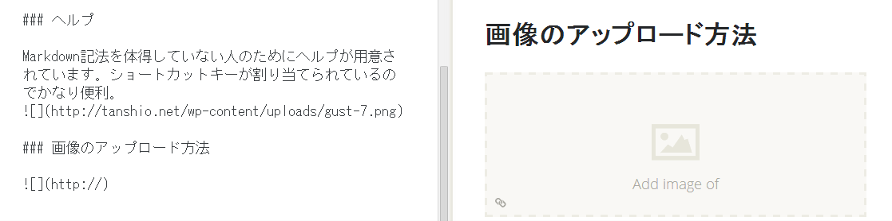
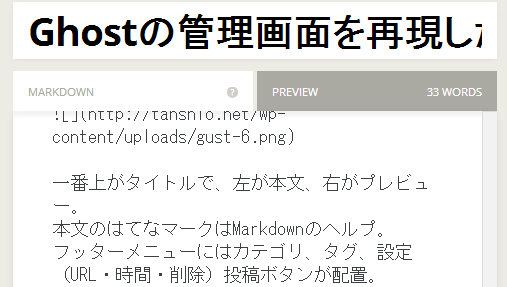

Ghostといえば、最近流行りのnode.jsで動くブログプラットフォーム。  
WordPressは最近になってwordpress.comでMarkdownを導入、インストール版ではjetpackプラグインなどでMarkdownを簡易的にサポートしだしました。  
一方、GhostはMarkdownでの投稿がメインであり、投稿画面はシンプル。どうにかしてこの投稿画面にWordPressもなんねーかなーと思っていたら、ついに登場してしまいました。

## WordPressプラグインGust

最近私が導入していたMarkdownプラグインに、SplitDownというGhostモチーフのものがあったんですが、Gustは管理画面・投稿画面すらGhostを完コピしてしまうという有り様。Ghostを使ったことをある人でもない人でもこの投稿画面に一回触れたらもう戻れなくなるんじゃないかな！

### インストール方法

既に公式プラグインとしてアップされているので、管理画面、もしくは[プラグイン公式サイト](http://wordpress.org/plugins/gust/)で**Gust**と検索し、管理画面からインストールするか、プラグインディレクトリにアップしインストールします。インストールしてからプラグインを有効化し、**パーマリンク設定を保存**します。  
Gustは管理画面を書き換えるプラグインのため、パーマリンクの設定を忘れないで下さい。(wordpressの管理画面はいつもどおり使えます)

その後、  
http://ドメイン名/gust  
というURLにアクセスするとgust用の管理画面が登場します。

##ログイン画面

##記事一覧画面

既にログインしている場合はこの画面に飛びます。

左の記事をクリックするとプレビューし、編集やらパーマリンクの設定、投稿日の設定、削除などが行えます。

メディアクエリが仕込んであるので、スマホ、タブレットなどにも対応しています。スマホ、タブレットの場合はプレビューが表示されません。

## 投稿画面

投稿画面はこんな感じ。

一番上がタイトルで、左が本文、右がプレビュー。  
本文のはてなマークはMarkdownのヘルプ。  
フッターメニューにはカテゴリ、タグ、設定（URL・時間・削除）投稿ボタンが配置。  
投稿ボタンの下矢印をクリックするとPublish Postというメニューがあるので、それをクリックすることで投稿できます。

### ヘルプ

Markdown記法を体得していない人のためにヘルプが用意されています。ショートカットキーが割り当てられているのでかなり便利。

### 画像のアップロード方法

Markdown記法による呼び出しか、Ctrl+Shift+I（これが便利）でプレビュー画面に画像埋め込みボックス的なものが登場します。  
ここをダブルクリックか、画像をドラッグすることで画像をアップロードすることができます。
なお、WordPressのメディアライブラリから埋め込むことはできませんので注意。（画像のURL埋め込みであれば可）

### 投稿画面もレスポンシブ

投稿画面もレスポンシブ。プレビューがタブ表示になります。

## まとめ
おそらく現時点で使えるMarkdownプラグインで最強。（1日しか触ってないけど）まさかGhostからそのまんま持ってくるとは思わなかった。
画像があると文字打つたびに点滅しやがる場合がある、文字がたまにどこ打ってるのかわからない、カスタム御三家には対応していないぐらいしか問題点がないので、WordPressを用いてMarkdownでブログやらやっている人にはおすすめです。ちなみにこの記事もGustで書いてみたよ！！めっちゃ楽っすわ！！
それではよいMarkdownライフを＼(^o^)／
