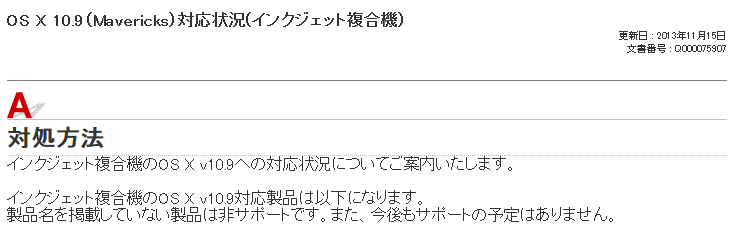
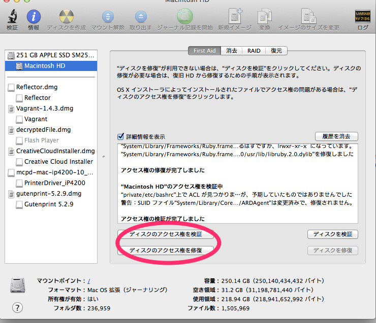
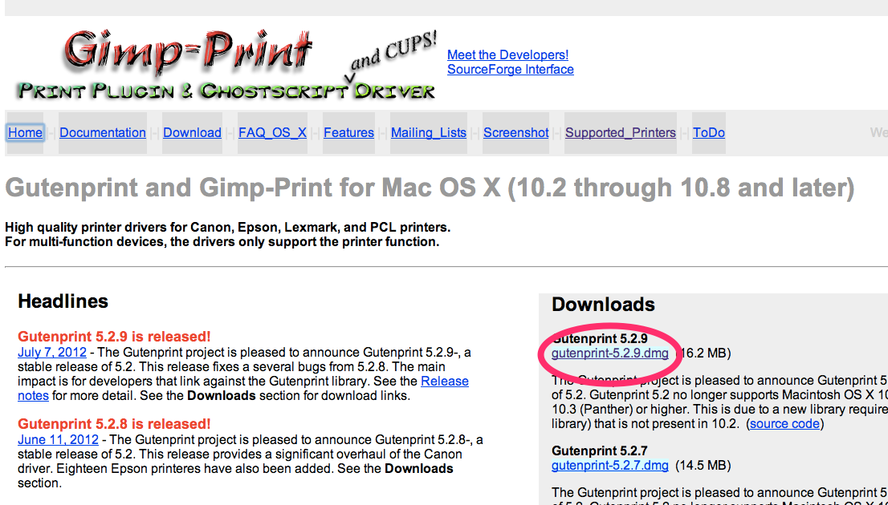
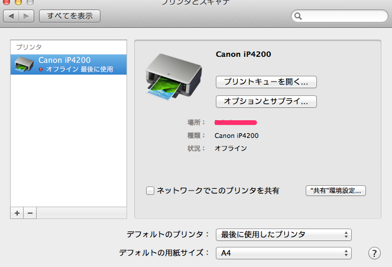

2014年は生きるか死ぬかというぐらい運がないわたくしです。多分2014年を生き延びることができたら150歳ぐらいまで生きれると思ってます。おそらく大雪が降ったのも私のせいです。申し訳ありません。

先週ぐらいのついていないこととしては、クライアントの1台しかないPCが電源故障というトラブルに見まわれ、業務が回らないということで私の愛機であるMac Book Airちゃんをなくなく1週間ほど貸すハメになりました。

そのクライアントはエクセルと印刷、メールができりゃあいいよということだったので特にトラブルもねーだろーなーと思いましたが、さすがは2014年ついていないわたくしです。すぐさま連絡が来て、印刷できねーんだボケカスこれだから林檎厨はとか言われたわけですね。あれれー5月ぐらいに持っていって印刷した時は普通に印刷できたから問題ないはずなんだけどなーと思って直行したら本当に使えないでやんの。なんじゃこれは。  
というかオフラインとか出てるしデバイスすら認識されてねーでやんの。

## 試行錯誤

オフラインのまま埒があかないので、一旦ドライバーを削除。その後USBをつなげてもドライバーはインストールされず、認識されてる感もなし。USBやMacが壊れるということはそうそう無いと思うので、まずは公式サイト（Canon）でプリンタードライバーを探してみると・・・

<a href="http://cweb.canon.jp/e-support/faq/answer/inkjetmfp/75907-1.html" target="_blank">OS X 10.9（Mavericks）対応状況(インクジェット複合機)</a>

製品名を掲載していない製品は非サポートです。また、今後もサポートの予定はありません。  
製品名を掲載していない製品は非サポートです。また、今後もサポートの予定はありません。  
製品名を掲載していない製品は非サポートです。また、今後もサポートの予定はありません。　　

クライアント先の機種はip4200という機種だったのですが、対応する気ゼロでした・・・＼(^o^)／ああそうかMavericsにアップグレードしたのが悪かったんだね・・・

##ドライバー探し

とりあえずLionまでのip4200用ドライバー、ip4300用ドライバー、更にはip4000用ドライバーとかインストールしてみても何も変わりませんでした。やはりこうなったらGoogle先生に頼みましょう。しかし日本語では見つからず、appleのフォーラムで解決策を探すことに。そしたら解決策らしきものがみつかりました。

##解決策はGutenPrint

appleのフォーラムでGutenPrintを試してみようという投稿があり、その後はできた！できない＞＜とかいう感じで賑わっておりました。んで、どうにかこうにか解決出来ましたのでメモしておきます。

GutenPrintとは、プリンタードライバーを新しいOSでも使えるようにするソフトです。インストールするときは非公式なので自己責任です。

###GutenPrintをインストールする前にディスクユーティリティでチェック

アプリケーション→ユーティリティからディスクユーティリティを選択し、所有権などがおかしくないかチェックします。おそらくPrinterフォルダの所有権が書き換えられているはずなので、修復しないと動かないです。

###GutenPrintをインストール

<a href="http://gimp-print.sourceforge.net/MacOSX.php" target="_blank">GutenPrint</a>

最新バージョンをダウンロードし、インストールしてください。

###確認

設定→プリンタとスキャナでちゃんとプリンターが認識されていれば印刷することができます。  
もし認識していない場合、USBをつけなおすと認識されるかもしれません。私の場合は繋げっぱなしでしたので、一旦外してつけたら認識されました。（上の画像はオフラインと出ていますが、先日私のもとに無事に帰ってきたのでプリンターが接続されていないためです。）
これで動かない場合は、一旦プリンターを全削除してもう一度最初からやれば動くはず。

###まとめ

とりあえずプリンターが動かないのは死活問題だということが身にしみてわかりました。つらいけどこれがMacの現状なのかもしれません。Windows8.1にはすぐさま対応しておりました・・・＼(^o^)／
