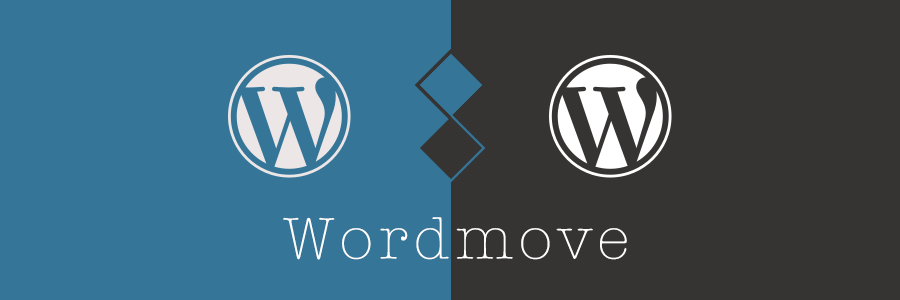

{<1>}

## wordmoveとは

<a href="https://github.com/welaika/wordmove" target="_blank">wordmove</a>

wordmoveは、WordPressをDBごと管理できるrubyのライブラリです。
ローカルからホストに、ホストからローカルに、SSH（FTP）を用いてDB、テーマ、プラグインなど利用法に合わせてアップロード・ダウンロードすることが出来ます。
Vagrant（VCCW、VVV）と一緒に使ったりすると便利です。

<time datetime="2014-09-08">2014年9月18日更新</time>

###インストール方法

VCCWであれば2014年9月18日に取り込まれました。

ruby1.9.3～、rubygemsは最新であれば動きます。

```
(sudo) gem install wordmove
```

### 使い方

- wordmove help wordmoveのヘルプ
- wordmove help [TASK] wordmove help pull 等でpullの詳細オプションを表示
- wordmove init wordmoveの設定に必要なyaml形式のMovefileを作成します。WordPressの基本ディレクトリで実行。
- wordmove pull ホストからローカルにファイルをダウンロードします。
- wordmove push ローカルからホストにファイルをアップロードします。

####pullとpushの引数

<pre>
  -w, [--wordpress]
  -u, [--uploads]
  -t, [--themes]
  -p, [--plugins]
  -l, [--languages]
  -d, [--db]
  -v, [--verbose]
  -s, [--simulate]
  -e, [--environment=ENVIRONMENT]
  -c, [--config=CONFIG]
      [--no-adapt]
      [--all]

</pre>

最初にwordmove pullで全て取り込んでテーマを開発・機能の追加、その後に、wordmove push -tなどでテーマだけアップするということも可能です。

引数は同時指定が可能ですので、wordmove pull -dtuと言った感じでデータベース、テーマ、アップロード画像を取り込むことも出来ます。

また、データベース（-d、--db）のコマンドを打つとローカル、ホスト共にバックアップが作成されますので、gitで管理が難しいDBなどで何かエラーが起こってしまった場合でも復元が可能です。

####デフォルト設定ファイル

wordmove initで出力される初期設定ファイルです。
ローカル部分はvhost以外WordPressの設定を読み取ってくれます。

```
local:
  vhost: "http://vhost.local"
  wordpress_path: "/srv/www/wordpress-default" # use an absolute path here

  database:
    name: "wordpress_default"
    user: "wp"
    password: "wp"
    host: "localhost"

staging:
  vhost: "http://remote.com"
  wordpress_path: "/var/www/your_site" # use an absolute path here

  database:
    name: "database_name"
    user: "user"
    password: "password"
    host: "host"

  exclude:
    - ".git/"
    - ".gitignore"
    - ".sass-cache/"
    - "bin/"
    - "tmp/*"
    - "Gemfile*"
    - "Movefile"
    - "wp-config.php"
    - "wp-content/*.sql"

  # paths: # you can customize wordpress internal paths
  #   wp_content: "wp-content"
  #   uploads: "wp-content/uploads"
  #   plugins: "wp-content/plugins"
  #   themes: "wp-content/themes"
  #   languages: "wp-content/languages"
  #   themes: "wp-content/themes"

  # ssh:
  #   host: "host"
  #   user: "user"
  #   password: "password" # password is optional, will use public keys if available.
  #   port: 22 # Port is optional
  #   rsync_options: "--verbose" # Additional rsync options, optional
  #   gateway: # Gateway is optional
  #     host: "host"
  #     user: "user"
  #     password: "password" # password is optional, will use public keys if available.

  # ftp:
  #   user: "user"
  #   password: "password"
  #   host: "host"
  #   passive: true

# production: # multiple environments can be specified
#   [...]


```

SSHかFTPを選択することができます。
用途に合わせてSSH・FTPをコメントアウトし、インデントを整理して下さい。yaml形式なためインデントがおかしいとエラーが出ます。（スペースとタブを一緒に使ってもおかしくなるので注意して下さい。）


---

## ハマったこと

**SSHであればsshpass、FTPであればlftpをインストールする必要があります。**

### 空白画面になる
サーバーがapacheの場合、.htaccessが無いためだと思いますので、wp-adminにログインして、パーマリンクの設定ボタンを押して下さい。.htaccessが作成されますのでそれにより解決されるはずです。

### 文字コードが違くてはねられる

charset: 'utf-8'

 をmovefileのデータベースの欄に追加すれば動くかもしれません。
 
### SSHできれる

ローカルからホストにSSHで一旦ログインすれば解決するかもしれません。

### yamlうんたらかんたら言われる
<s>VVVの環境ではbase.rbにrequire 'yaml'が無いためエラーが出ていました。色々インストールすればrequire 'yaml'を付け加えなくてもいいのですが、base.rbに付け加えることでyaml形式のファイルを読み込むことが出来ました。</s>（既にwordmoveに取り込み済み）

### mysqldumpのパスを合わせる必要がある
ここはcoreserverを用いて運営しているのですが、coreserverのmysqldumpのパスが特殊なためrsyncがエラーを起こしているのかmysqldumpがないよというエラーが表示されdumpできませんでした。

さくらのレンタルサーバー、VPS、Xserverなどでは動いたため、mysqldumpのパスを合わせる必要がありそうです。これについては小学生並みの貧弱英語スキルで開発者さんに提案済みです。

```
which mysqldump
/usr/bin/mysqldump
```
サーバーでwhichして上記のとおりであればSSHでは動きます。

### FTPだと挙動が不安定

ロリポップのようにSSHが使えないサーバーの場合、FTPを使う必要があります。  
FTPだと、~/.lftprcに、

```
set ssl:verify-certificate no
set ssl:check-hostname no
```

（上の1行だけでもOKかも）
上記の設定をしてあげないといけません。セキュリティ上あれなので、ロリポップなどでやる場合は自己責任でお願いします。

**また、FTPの場合ですと途中で止まる確率が高いので注意してください。止まっても放置すれば再開されます。**

シリアライズがうまく行われない場合が多いのでSSHが使えるサーバー以外はおすすめしません。

### SSHとFTPでパスの書き方が違う
ローカル部分はそのままでいいのですが、SSHの場合とFTPの場合とでパスが異なります。

```
wordpress_path: "/var/www/your_site"
```
SSHは絶対パス（WordPressまでの全部）となりますが、FTPではログインした場所からのパス（言葉では言い表しづらい）となります。

Filezillaなどでホストにログインした際に、/var/www/が表示されていたら、
```
wordpress_path: "/your_site"
```
と修正します。

## はてなマークになる

Windows版波ダッシュなどがデータベース（投稿など）にあると、push時にはてなマークに変換される場合があります。プラグインがあるのでそれで対処するか、波ダッシュを〜（Mac版波ダッシュ）にして下さい。メイリオで表示すればWindowsでもMac版波ダッシュは綺麗に表示されます。

---

## よくわからないところ

引数の順番の関係なのかどうかわかりませんが、プラグインのデータがたまにおかしくなる場合があります。wp-pagenavi（ほぼ100%）、WordPress SEO by Yoast（たまに）で確認しています。

Advanced Custom Fieldsなどは大丈夫なので、他にテーブルを作る奴が怪しいかもしれません。更新時など、pushをする場合は慎重に行って下さい。

---

##おわりに

テーマや自分で使うプラグインの開発にwordmoveはもってこいです。  
<s>ただ、データベースをローカルからホストにpushする際は注意が必要です。
バックアップをしっかり取り、問題になりそうなキャッシュプラグインなどを一応一旦解除し、wp-cliがインストールされている環境であれば

wp search-replace ローカルドメイン ホストドメイン

でシリアライズされた文字ごと書き換えたあと移動してください。</s>

SSHの場合的確にシリアライズされます。FTPだとバグる可能性が大なのでSSHをおすすめします。

また、pushする場合マージされず上書きなので、バックアップは作成されますが、pushは慎重に行うことをおすすめします。

ローカル→ホストのテーマ変更が wordmove push -tで済むのは非常に便利なのでぜひお試しください。
