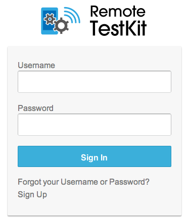
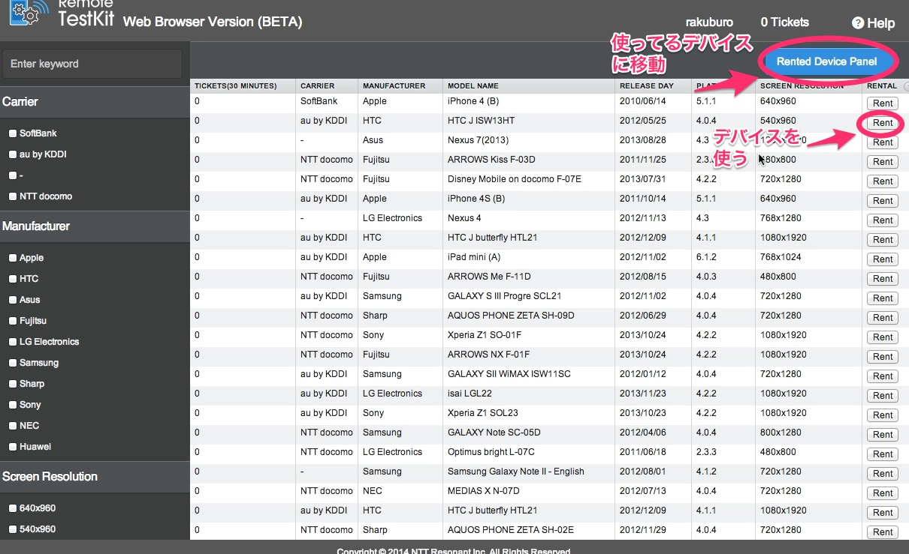
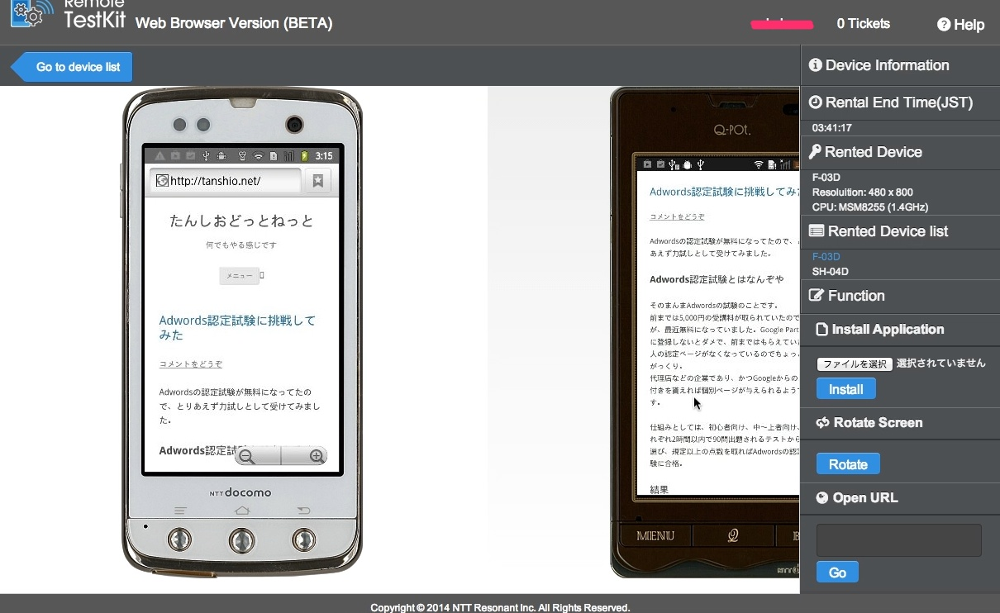

今まではIE6やらIE7やらにさんざん苦しめられていましたが、現在フロントエンドエンジニアなど、CSS・Javascriptを扱う人々を苦しめているのはAndroidではないでしょうか。アプリの開発でも苦しめられている人がいると思います。

そこでAndroid向けの開発を楽にしてくれそうなRemote Testkit WEB版というものがありましたので紹介したいと思います。

##なぜAndroidが問題なのか

Androidはバージョンで仕様が異なり、更に機種ごとに仕様が異なり色々とやばい。  
特に日本のガラスマと呼ばれるスマートフォンはすごくやばいためjQueryからも見捨てられる運命となるぐらいやばいです。

一番やばいのは機種数が多すぎるということではないでしょうか。そこで使えるのがRemote Testkit WEB版です。

##Remote Testkit WEB版で実機検証してみよう

去年の10月にCSS Niteに参加した際Remote Testkitの紹介があり、無料版を使ってみたのですがかなり使えるものでした。しかし個人で使う分には高いため検証などはエミュレータ、少ない実機で行っていました。

前にRemote Testkitについてツイートした所、運営元のNTTレゾナントさんからWEB版もあるよというリプライをもらったので使ってみたところ非常に良く出来ていました。あんまり話題になっていないみたいでしたので紹介します。

**2014年4月16日現在、ベータ版のため無料で使えます。**

###Remote Testkit WEB版の使い方

####会員登録
まずは会員登録が必要になりますので登録します。

<a href="https://webapp.appkitbox.com/#!login" target="_blank">https://webapp.appkitbox.com/#!login</a>

Sign Upを押すと登録画面に移動します。  
必要項目を入力すると、メールアドレスにキーが届きますので入力するとRemote Testkit WEB版が使えるようになります。

####機種を選ぶ

使いたい機種はキャリアを選んだり、メーカーを選んだりなどで絞ったりすることもできます。  
機種の一番右にあるRentで機種を使うことができます。  
青いボタンは使ってる機種一覧画面へと移動します。

####機種を使う

機種は複数使用することができます。右に機種がどんどん追加されていく感じです。  
機種ごとにアプリをインストールさせることも出来ました。  
ブラウザを開いてURLを打ち込むより、Open URLを用いたほうが楽です。

####注意点

5分間使ってみて気になったことを羅列しました。

- Chromeオンリー。
- Mac book Airで機種間を移動するとき、気をつけないとジェスチャーでブラウザの戻るが発動する。
- キーボードのエミュレートが1機種でしか動かない気がする。（設定があるのかも。）マウス操作は可。
- スクロールが若干めんどい。
- 1日2時間まで。

##まとめ

モバイルファースト的な動きが加速していく中で、Androidでちゃんと動くかどうかは非常に重要になってきていると感じています。  
jQueryのSidrというドロワーメニューを利用したサイトがあったのですが実機のAndroidでは全く動かなくてビビったことがああります。  
そういうブラウザの挙動を実機で確認する上でRemote Testkit WEB版は非常に使えると思います。（今無料ですし）
今後有償化してもCreative Cloudと同じ価格帯であれば個人でも手が出やすくなるんじゃないかなーと思います。
