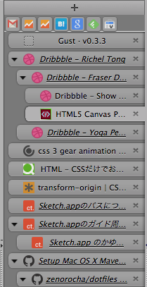
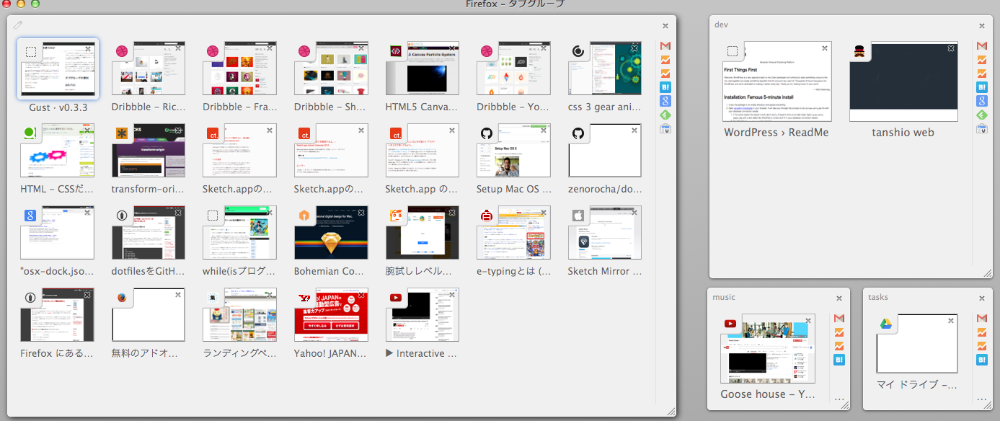

いまどきのWEB制作者の大半はChromeを使っていると思うのですが、私はメインブラウザとしてFirefoxを使っています。Firefoxのシェアが徐々に落ち始めているっぽいのでFirefoxの利点をご紹介したいと思います。

##ツリー型タブが便利

Firefoxはアドオンで成り立っていると言っても過言ではないのですが、その中でとりわけ優秀なアドオンがツリー型タブです。上記キャプチャ画像のように階層で分けられ、別タブで開いた時にわかりやすいです。

WindowsでFiregestureなどを用いており、それをトラックパッドを用いるMacと同期するとタブバーで2本指スクロールが効きません。なので私はアドオンの同期を解除し、トラックパッドでは使わないのでジェスチャープラグインを削除しました。
Tab Mix plusを用いている場合は、設定→マウス→マウスジェスチャー→タブバー上でのスクロール操作にチェックを入れるとタブバーで2本指スクロールが動きます。

Macの場合はツリー型タブとTab Mix Plusを併用する場合、はTab Mix Plusのセッションマネージャーを使うとFirefoxを開いた時に全タブ一括読み込みされてしまい起動時にイライラします。イライラは体に悪いのでFirefoxのセッションマネージャーを使うと全タブ一括読み込みされなくなり非常に快適です。

##タブグループが便利

タブをグループ化することができます。
私の場合は音楽垂れ流しグループ、開発グループ、ネットサーフィングループ、タスク管理グループ、サイト更新用グループなどに分けて活用しております。タブのピン留め、ツリー型タブと一緒に活用するとかなり使えます。  
前はPanoという最強のタブグループ管理プラグインがあったのですが、おなくなりになってしまいました。

###ショートカットキーで更に便利

control+`でタブグループの移動、command+shift+eで上のキャプチャのようなタブグループ一覧が表示されます。移動はサボってるのバレそうなときとか、怪しいタブ開いている時とかに使えます。

##コーディングの時に便利

CSS3で色々やった時に（Flexboxとか）IE11よりもFirefoxで躓く可能性が高いので最初に攻略しておくとイライラしないで済みます。

前まではFirebug最強伝説だったのですが、最近ではどのブラウザでも開発者ツールが頑張ってるのでFirebugの優位性がなくなってきてる気がします。

##ダメな所・心配な所

- Macで閉じるボタン押すと死ぬところ。（閉じる時はcommand+qで乗り切る）
- 新しいバージョンでUIが変ちゃうので、それでツリー型タブが使えなくなったらどうしよう。

##おわりに
宗教上の理由です。
