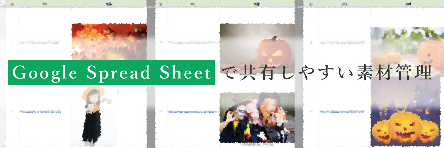
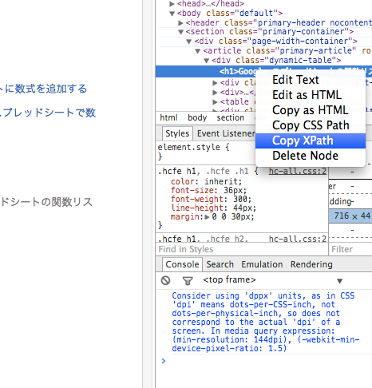
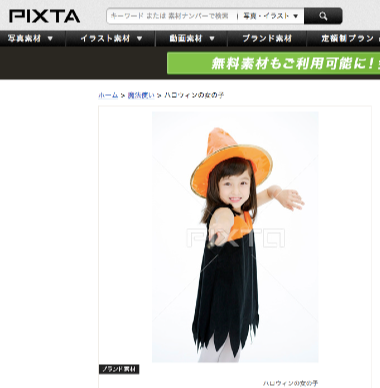
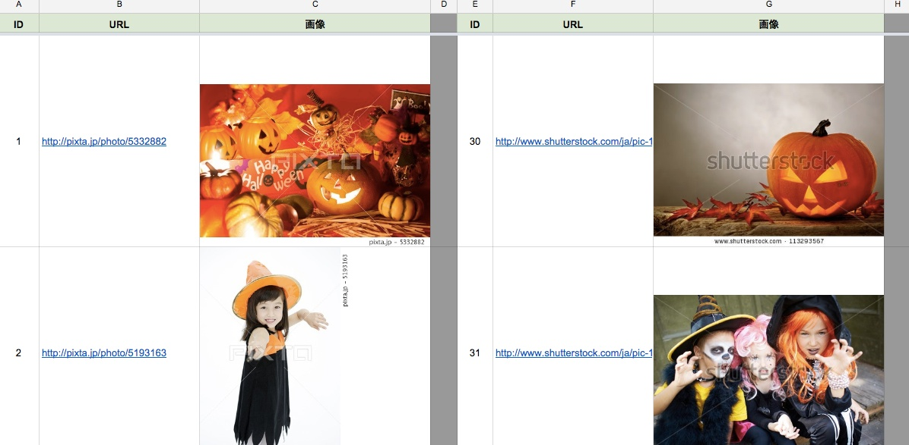

素材をクライアントやメンバーに共有するときに皆さんはどのように行っていますか？

メール、テキスト、HTML、CMS、Evernote...などなど、様々な共有ツールがありますが、私は**Google Spread Sheet**をおすすめします！

## Google Spread Sheetとは
Googleが運営するExcel（のような表計算ツール）。

- Excelにない関数
- JavaScriptスクリプトによるマクロ
- Googleサービスとの連携
- バッチ処理

などなど、様々な機能があるウェブベースの表計算ツールです。  
最近アップデートがかかり、実質容量無制限、関数の制限などがなくなり私にとっては無くてはならないツールになりました。

デメリットとしてはエクセルでいうピボットテーブルが貧弱なこと（GetPivotData、グループ化、ソート機能の充実、テーブルが使えない）が挙げられますが、それを補って余りある機能が充実しています。

## Google Spreadsheetで画像を管理してみよう

ExcelでもGoogle Spreadsheetでも、画像の埋め込みは可能です。<s>SEだとキャプチャを撮って貼り付けという拷問みたいな作業があるとかないとか。</s>

エクセルでは挿入であれこれやるしかないと思いますが、Google Spreadsheetには私の知ってる限り3種類の画像埋め込みの方法があります。

- Excelと同じように挿入
- IMAGE関数を用いてセル内に表示
- Google Apps Scriptで頑張る

Google Spreadsheetには、URLさえわかれば画像をセルに表示できるIMAGE関数というものがあります。ウェブベースの利点とも言える関数を用いてセル内に画像を簡単に表示させることが出来ます。

## IMAGE関数を使おう

=IMAGE(URL, [モード], [高さ], [幅])

<a href="https://support.google.com/docs/answer/3093333">IMAGE関数について</a>

例

=IMAGE("http://k.yimg.jp/images/top/sp2/cmn/logo-ns-131205.png")

 
 でYahooのロゴがセル内に表示されます。
 
 URLさえわかれば画像が簡単に表示できるので便利ですね！
 
## 応用してPixta、Fotolia、ShutterstockのリンクURL付き画像集をつくろう

Google Spreadsheetには、組み合わせることによって便利な関数がまだまだたくさんあります。ここでは前述したIMAGE関数と組み合わせることによって簡単に画像を表示させるカスタマイズ方法を紹介します。

### IMPORTXML関数を使ってsrc属性を抽出

Google Spreadsheetで備わっている、IMPORTXMLという関数を用いることにより、XPath形式でHTMLを抽出することが出来ます。

前のSpreadsheetのバージョンでは制限がありましたが、現在では制限が取り払われたため自由に使うことが出来るようになっています。

#### XPathについて

XPathとは、JavaScriptでいうDOMみたいな感じで特定の部分を抽出することができる言語構文です。

上記のように大体の開発者ツールにはXPathのコピーが備わっていますので、それを元にXPathの理解を深めることも出来ます。なれればDOMよりも簡単に特定部分を抽出できる場合もあるため、スクレイピングなど、データを集めるときに重宝します。

詳しくはWikipediaなどをご参照下さい。  
<a href="http://ja.wikipedia.org/wiki/XML_Path_Language" target="_blank">XML Path Language Wikipedia</a>

## 詳細URLから画像を抽出する

通常のストックフォトサイトの場合だと、上記のように写真素材ごとにURLが割り振られています。  
そこにメインのサムネイル画像が表示されていますので、そのURLを抽出すれば後はIMAGE関数でチョチョイのチョイですね！

### 各サイトのXPath

**PIXTAのXPath**  
//*[@id='imgZoomArea']/*/*/@src

**ShufflestockのXPath**  
//*[@class='thumb_image']/@src

**FotoliaのXpath**  
//*[@class='content-view-thumbnail']/*/@src

## 作成例

<a href="https://docs.google.com/spreadsheets/d/1D30B6oBsm6rPtkkRjJ5KvyHOTM3cu75Vp2EIoPZLStw/edit?usp=sharing" target="_blank">写真素材スプレッドシート</a>

いろいろいい感じにすると、上記のような感じになります。自分のスプレッドシートにコピーすることも出来ます。（時と場合によってはLoadingがずーっと出てで見られない場合があります。その場合はURLセルを消して戻せばなぜか再度表示されます。）

## 効率化しよう

詳細URLがわかれば上記のようなスプレッドシートが簡単にできることがわかりました。   
いちいちスプレッドシートにぺたっと貼り付けるのもアレなので、全てのタブのURLをコピーし、スプレッドシートに貼り付けるだけにしてしまいましょう！

**Chromeの場合**  
<a href="https://chrome.google.com/webstore/detail/make-link-of-all-tabs/mlmmahhmlolgeigpchjnolpdjhcihmod?hl=ja" target="_blank">Make Link of All tabs</a>

**Firefoxの場合**  
<a href="https://addons.mozilla.org/ja/firefox/addon/firelink/" target="_blank">Firelink</a>

上記アドオンを用いることにより、全てのタブを改行区切りにすることが出来ます。

Fotolia、Pixtaなどで新規ウインドウを作成し、良さそうな画像の詳細ページをどばばばばーっと開いた後アドオンを発動させるだけで全タブのURLが抽出できます。あとはスプレッドシートに貼り付けるだけですね！あとは共有しておしまいです。

## まとめ

こんなかんじで、Google Spreadsheetを用いることにより、さくっと画像を共有することができちゃいます。

IMPORTXMLのXPathはうまくいくサイトとうまくいかないサイトがあるため、3回同じようなXPathかいてうまく行かなかったら諦めるのも手です。サイトがリニューアルなどした時などXPathは変わってしまいますのでお気をつけ下さい。

画像は直リンクになってしまいますので、あまりやり過ぎないことをおすすめします。（おそらくGoogleでキャッシュしているとは思いますが。）

他にもこういう共有方法があるよ〜という方は教えて下さい！それでは良い共有ライフを〜
