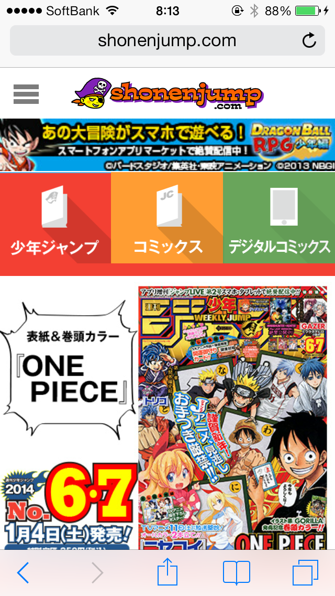

[週刊少年ジャンプの公式サイト](http://www.shonenjump.com/j/)を眺めていたら、ロングシャドウデザインが採用されていました。

どうやら[12月9日](http://www.shonenjump.com/j/)にリニューアルした模様です。PCサイト、スマートフォン向けサイト共にロングシャドウデザインが採用されています。

## ロングシャドウデザインとは

ロングシャドウデザインとは、2013年6月頃から注目されている、フラットデザインに長い影をつけたような感じのものです。 影は直線型だとか、だんだん広がる型だとか、影の距離が長くなるに従い薄くなるなどのパターンが有りますが、アイコンなどに長い影がついていれば文字通りロングシャドウデザインといってもいいんじゃないでしょうか。

## ロングシャドウデザインというか最近のフラットデザインの印象ってどうなの

6月頃から話題になっていたロングシャドウデザインが、少年ジャンプという漫画界の帝王の公式サイトで採用されたのがびっくり。なんというスピード。そこにしびれ（ｒｙ

でも、わたくしといたしましてはなんつーかあっさりし過ぎてこう、楽しさというかエンターテイメント性が薄れてしまったような気がしないでもない気がします。スタイリッシュな最先端事業とかWEB業界が最適だと思っていました。

なんかごちゃごちゃしてるほうが楽しさというかエンターテイメント性が高まるというか、東京ディズニーランドがフラットになったら違うよなーと思っていたら、[東京ディズニーランド公式サイト](http://www.tokyodisneyresort.jp/)も若干最近のトレンドっぽいサイトになっとる・・・＼(^o^)／ これが時代の流れなのだと実感いたしました。やはりビッグウェーブには乗るしか無い。
