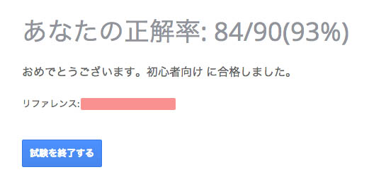
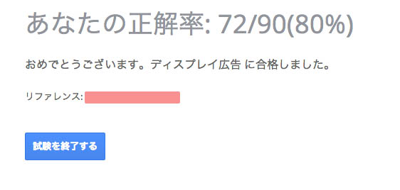

Adwordsの認定試験が無料になったので、とりあえず力試しとして受けてみました。

##Adwords認定試験とはなんぞや

そのまんまAdwordsの試験のことです。  
前までは5,000円の受講料が取られていたのですが、最近無料になっていました。Google Partnerに登録しないとダメで、前まではもらえていた個人の認定ページがなくなっているのでちょっとがっくり。  
代理店などの企業であり、かつGoogleからのお墨付きを貰えれば個別ページが与えられるようです。

仕組みとしては、初心者向け、中〜上者向け、それぞれ2時間以内で90問出題されるテストから2つ選び、規定以上の点数を取ればAdwordsの認定試験に合格。

##結果

うかりました。どちらとも30〜45分ぐらい時間が余りました。

##まとめ

雑感としては、カンニングの防止をしてほしい（調べられちゃうので）、同じ質問がたまに出るのを何とかしてほしいぐらいでしょうか。  
SEMやLPOをインハウスでやってる、ディレクションしてる人などは力試しに受けてみることをおすすめします。適当な自分でも受かるので、広告の運用経験がある人であればほぼ受かると思います。    

次はAnalyticsの資格を取ろうと思うのですが、今週全て飲み会というお財布にやさしくない経験をした上、いろいろ買いまくってカード切れなくなってしまったので25日ぐらいに受けたいと考えています。
Creative Cloudとかが引き落とされる前に上限が解除されないと死ぬ気がする＼(^o^)／
