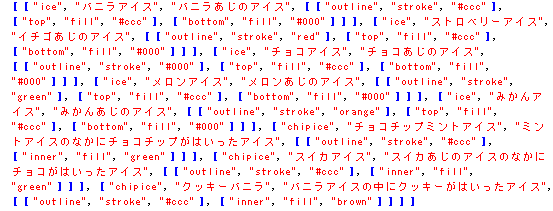
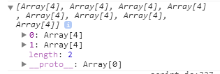

現在午前4時なのですが、仙台ではセミが鳴いています。皆さん今日も元気にpushしておりますか。

pushといえば最近ではgitですが、JavaScriptの配列のコピーなどでも使いますよね。  
concatでもいいんですが、あいつは多次元配列でも容赦無いのでここでは華麗にスルーします。  
ゲームを作っていたのですが、その時に配列のコピーで悩んだことがあったのでメモしておきます。

## 参照でハマる

下記のようなオブジェクトがあったとした時に、

<script src="https://gist.github.com/tanshio/727f909fd9339c97f445.js"></script>

オブジェクト内の配列をまるごとコピーして、更にキーを配列の最初に取り付けたいというわがままコードを作成していたのですが、まんまと参照という罠に引掛かって2度めのアクション時に壮大にバグりました。


アイスの種類の左側にiceやchipiceというカテゴリーをつけたかったのですが、参照だったため2度目以降はice,iceとかダブるという素晴らしいコードになってしまいました。
一番簡単なのはオブジェクトに書き足すということなのですが、負けたくなかったため頑張りました。


### ケース1 pushとかしまくる

配列を走査して、配列かどうかを確認しpushとかしまくる。配列の値が長いかつ面白く無いので却下

### ケース2 JSON.parseとJSON.stringifyで完結

```
JSON.parse(JSON.stringify(配列やらオブジェクトやら))
```

もともとJSONだったのを埋め込みたいがためにオブジェクトにしたためてんてこまいだったけど、JSONでパースしてしまえばオブジェクトでも配列でもなんでもかんでもディープコピーできるので楽。

## コード

<script src="https://gist.github.com/tanshio/31e97a56a1abaf553a1d.js"></script>

## まとめ

Firefox


Chrome


Chromeでは、なぜかJSON.parseしたやつだと、配列をいじるかなにかしないとインスペクタでバグってるような感じになる。しかしながらちゃんと配列として格納されているのでインスペクタがおかしいんだと思います。

IE7以下の呪われしブラウザ以外は動くので配列やオブジェクトをコピーしたい場合には楽だと思います。
全然関係ないですけどライブラリを用いないでゲームを作ると自分のスキルの物足りなさを実感できるのでオススメ。
