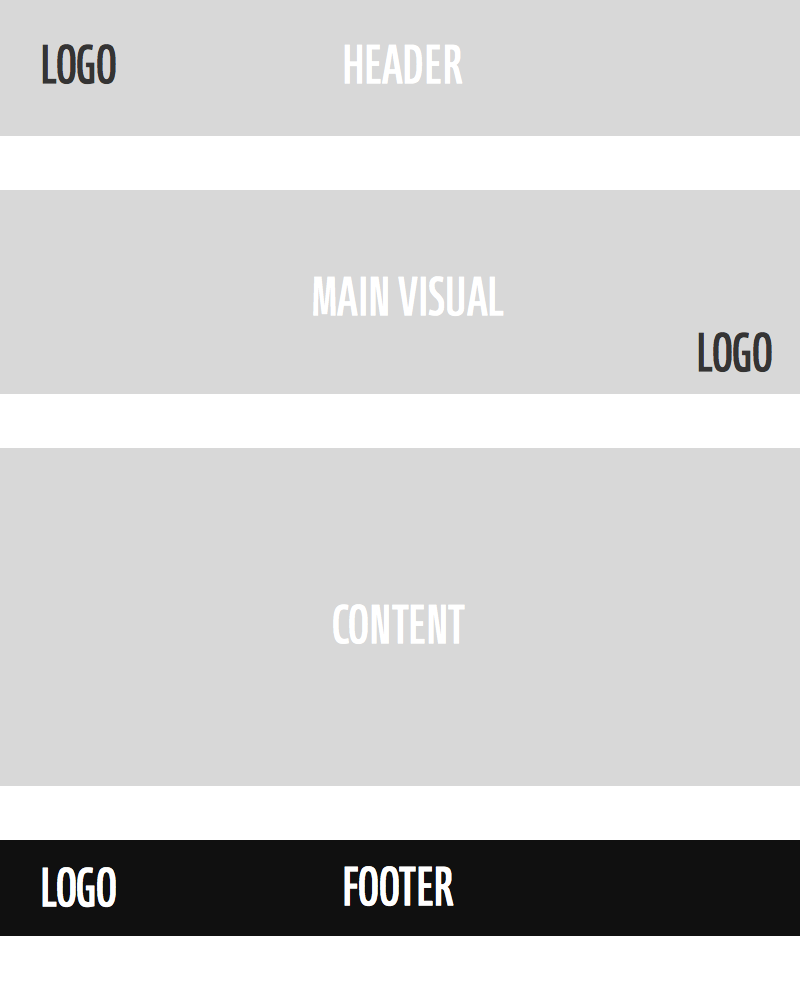
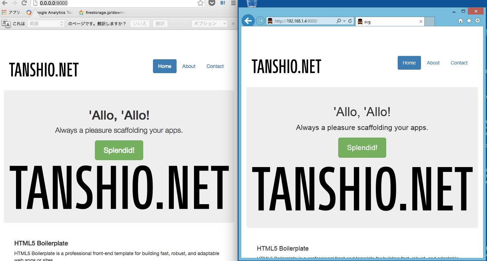
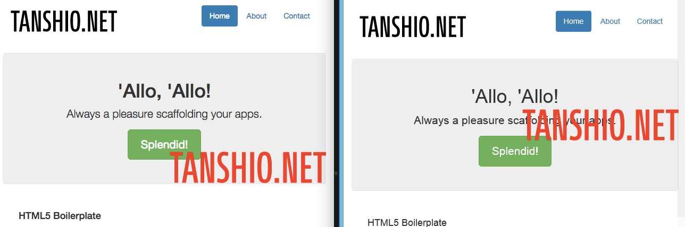
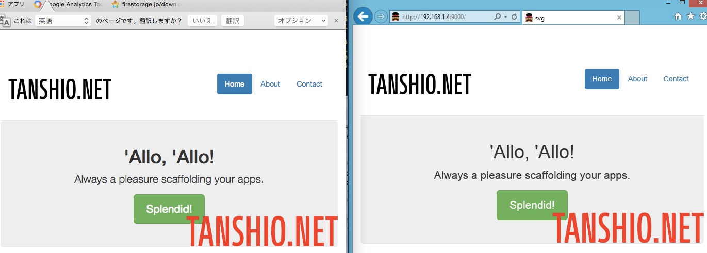

これはSVG Advent Calendar 2014の参加記事です。
昨日（12/4）は<a href="https://twitter.com/shino212" target="_blank">shino212</a>さんの<a href="http://yami-irodoruhana.tumblr.com/post/104283800389/svg" target="_blank">「はじめてSVGでアニメーションを作った時の話」</a>でした。おじさんのアニメーションが可愛い。

6日に投稿しようと思ったのですが、空きがあるので5日も投稿することにしました。まだ空きがあるのでぜひご参加下さい。

## SVGスプライトとは
body直下などにインラインSVGを貼り付け、gタグの代わりにsymbolタグを用いて使いまわす手法です。リクエスト数を減らす効果があり、ページを書き換えるタイプのpjaxやSPAと一緒に用いるといい感じがします。

## SVGスプライトでハマる



上記のように、ロゴを多用している箇所をSVGスプライト（symbol）を用いて対処しようとしてハマりました。  
メインビジュアル部分の所をposition:relativeをかけ、SVGにabsoluteをかけ対処したところ、IEと他のブラウザで見え方が異なってしまいました。


右はWindows8.1のIE11。Windows7のIE9、10でも同じでした。

```
      <!--  .jumbotronにposition:relativeをかけてあります -->
      <div class="jumbotron">
        <h1>'Allo, 'Allo!</h1>
        <p class="lead">Always a pleasure scaffolding your apps.</p>
        <p><a class="btn btn-lg btn-success" href="#">Splendid!</a></p>
        <!--  シンボル化したSVGを読み込み、赤にする-->
        <svg viewBox="0 0 294 60" class="main-v__logo">
          <use xlink:href="#logo"
               x="0" y="0"/>
        </svg>

      </div>

```

なお、position:absoluteをかけなければ同じ表示になります。



まあ、普通の画像であれば、
```
position:absolute;
width: 指定px;
height: auto;
bottom: 0;
right: 0;

```
で右下固定で表示されると思ったのですが。。。



ずれて表示されてしまいました。

## 解決策

高さを指定してあげることで解決出来ました。



スタイルか、svgに高さをふってあげることでIEでもposition:absoluteで絶対配置することが出来ました。

<a href="http://dev.tanshio.net/svg/" target="_blank">サンプルはこちら</a>

## おわりに
IEのSVG表示はきれいなのですが、いろいろハマりどころがあるのが難点。

明日（というか今日）のSVG Advent Calendar 2014も僕が投稿します。内容はまだ考え中です。
