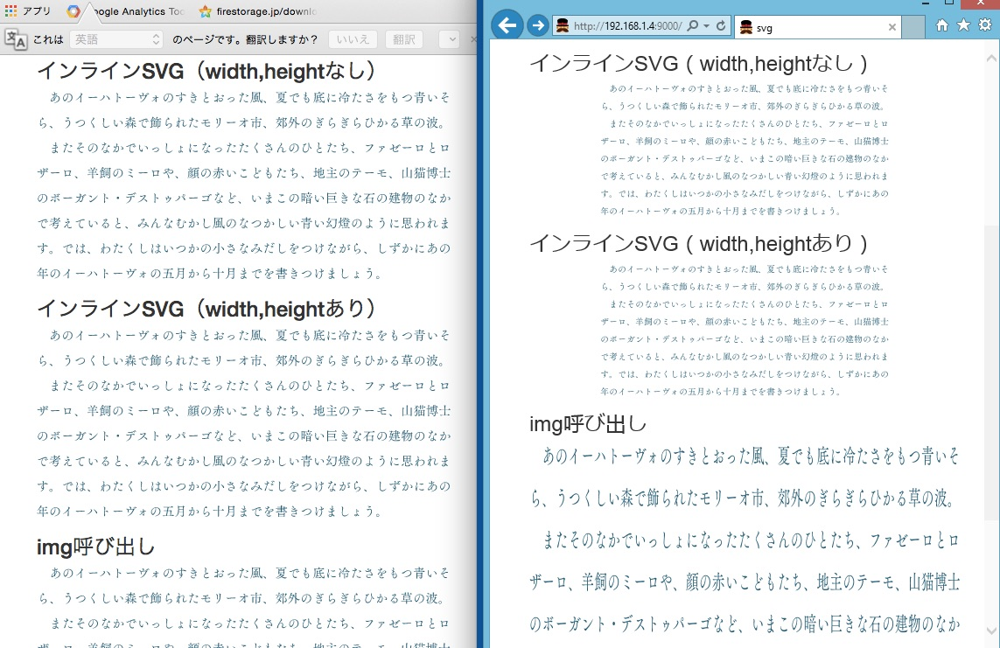
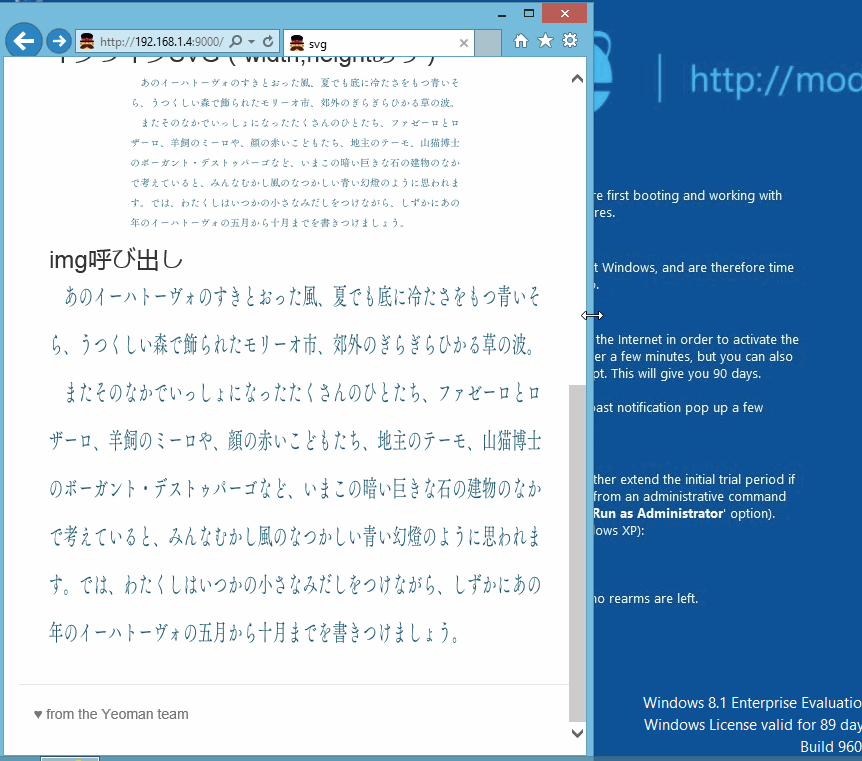

これは<a href="http://www.adventar.org/calendars/366" target="_blank">SVG Advent Calendar 2014</a>の参加記事です。
昨日（12/5）に引き続き僕が担当します。
明日（12/7）も空きがありますので、ぜひご参加下さい。

## レスポンシブなSVGを作る

SVGは、Retinaであっても綺麗に表示されるため、僕はテキストや図など、Retinaのために2倍サイズを書き出すのが面倒くさい箇所をSVGで書き出しています。

通常のimg要素であれば、

```
img {
  max-width:100%;
  height:auto;
}

```

的な感じで、ウィンドウ幅が狭まっても横100%で画像が表示されるはずです。svgでも同じような感じにしてあげると、モダンブラウザではうまく表示されるはずです。

### IEで表示がバグる

ところがどっこい、IEだけはうまくいきませんでした。
（ここでのIEはIE9、10、11を指します。）



ChromeとIEの比較。Firefox、SafariもChromeと同じ表示でしたが、IEだけは表示がおかしい。

サンプルscss
```
.mod-img {
  img,svg {
    display: block;
    max-width:100%;
    height: auto;
  }
}

```

<a href="http://dev.tanshio.net/svg/responsive.html" target="_blank">サンプル</a>



インラインSVGでは高さが計算されていない、呼び出しではアスペクト比がうまく計算されていないような表示の仕方をしています。

## 解決策

###インラインSVGの場合

サンプルscss
```
.mod-inline-svg {
  position: relative;
  height:0;
  padding-top:45%;//アスペクト比。サンプルでは360/790なので大体で45%にしています。
  svg {
    display:block;
    position: absolute;
    height: 100%;
    width: 100%;
    top:0;
    left:0;
  }
}

```
レスポンシブiframeと同じような仕組みです。

### 呼び出しの場合

imgに横幅をセットしてあげるだけです。横幅100%だったら100%をセットします。

```
        <div class="mod-img">
          
        </div>

```
IEではどうやらimgに横幅をセットしてあげないと高さを計算してくれないようです。


IEでもうまく表示することが出来ました。

<a href="http://dev.tanshio.net/svg/responsive-finished.html" target="_blank">サンプル</a>

## おわりに
SVGを通常の画像として用いると結構ハマりどころがたくさんあります。（特にIE）
レスポンシブはデファクトスタンダードになりつつあるので、SVGを使おうと思ってこれでハマっていた人たち、これからハマる人たちの助けになれば幸いです。

7日の<a href="http://www.adventar.org/calendars/366" target="_blank">SVG Advent Calendar 2014</a>にまだ空きがありますのでぜひぜひご参加下さい。
