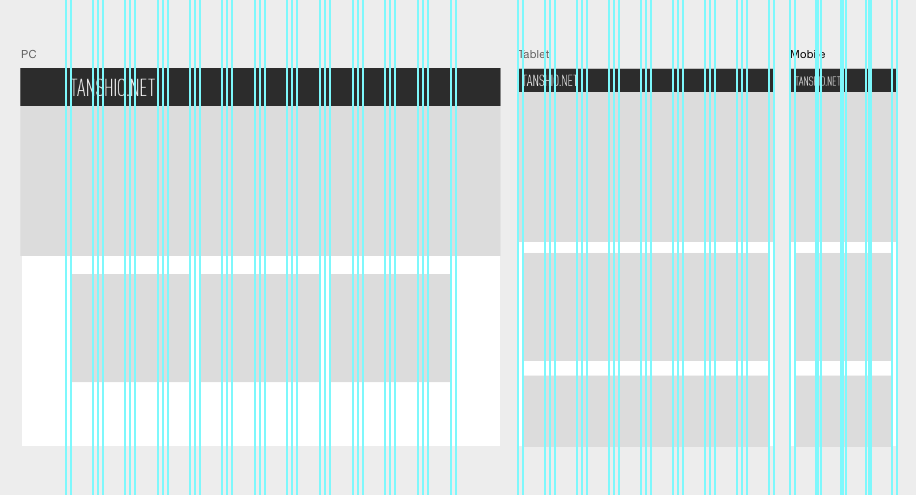

最近リリースされたPhotoshop CC 2015で、ついにアートボードが搭載されました。  
Sketchもたまに使うのですが、僕の場合はPhotoshopもイラレも開いて作業している場合が多くて、何してんだろうといった感じだったので素直に嬉しい感じです。

Sketchではアートボードごとにガイドが適当に引けて便利だったのですが、Psのガイドを作成するやつだと、いろいろおかしくて使い物になりませんでした。アートボードというものを認識していない感じ。

アートボードで作れれば便利なのになーと思って、今まで入れていた<a href="http://guideguide.me/">GuideGuide</a>というプラグイン動くのかなと思ってたら、CC 2015用にアップデートされていました。そんでもって、便利なことにアートボードごとにガイドが引けるようにもなっていました。

## 使い方

<a href="http://guideguide.me/">GuideGuide</a>からダウンロード、インストールし、Photoshopを起動。アートボードをクリック後、GuideGuideのパネル（なければ表示）からアートボードに合わせたグリッドが引けます。

## 作成例
<a href="https://www.dropbox.com/s/z0tvzmxfpk0csz2/base.psd?dl=0">上の画像のpsdファイル</a>（2015じゃないとグループになります）

なんだかんだでPhotoshopから逃げられないな～と感じている今日このごろです。
