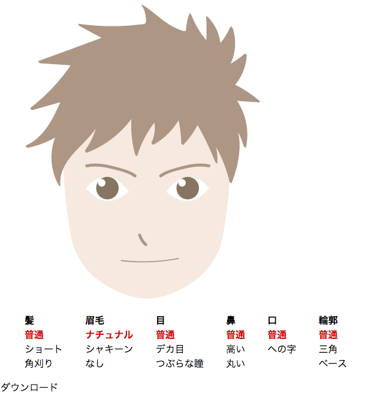

この記事は<a href="http://www.adventar.org/calendars/1428">SVG Advent Calendar 2016</a>の第11日目の参加記事です。

10日に厨二病SVGエフェクト集をまとめたものをアップしようと思ったのですが、真面目に時間なくて断念しました。
そこで、私が贔屓にしているVueでぱぱぱっとSVGを用いたアバターアプリ的なものを作ってみました。
時間の関係上装飾は簡素、スマホに最適化してないなどいろいろアレですがお許しください。なお、webkit環境でしか確認していません。

## アバターアプリ的なもの

[アバターアプリ的なもの](https://tanshio.net/svg2016/)

VueはSVGも操作できるため、最初に全部表示したものを分岐で隠しているだけです。
その後非表示Canvasで画像化してダウンロードできるようにしてあります。

ソースコードは<a href="https://gist.github.com/tanshio/fe0b9b28f2a44f446300ee3fcda06d5b">こちら</a>
aiデータは<a href="https://dl.dropboxusercontent.com/u/62124656/%E3%81%8D%E3%81%9B%E3%81%8B%E3%81%88.ai">こちら</a>

これ自体は私が運営するサイトでやろうと思ってたことなのですが、この機会にやってみることにしました。
計１時間でできるだろうと思ったら、画像作るのに１時間かかりました…昔はフラッシュでやってたものがJSとSVGでできるようになったというのは感慨深いものが有ります。

ソースと言うほどのものじゃないので、ソースもイラレデータも使いたい人は勝手に持っていってOKです。

色を変えたりサムネイル表示したり、パーツの位置を変えたりなど、Vueであれば色々簡単にできそうですが、真面目に死にそうなので年末年始の暇な時にでもできたらいいかな的な感じです。

<a href="http://www.adventar.org/calendars/1428">SVG Advent Calendar 2016</a>はまだ空きがあるのと、イラスト参加でもOKみたいなので是非参加してみてください〜
