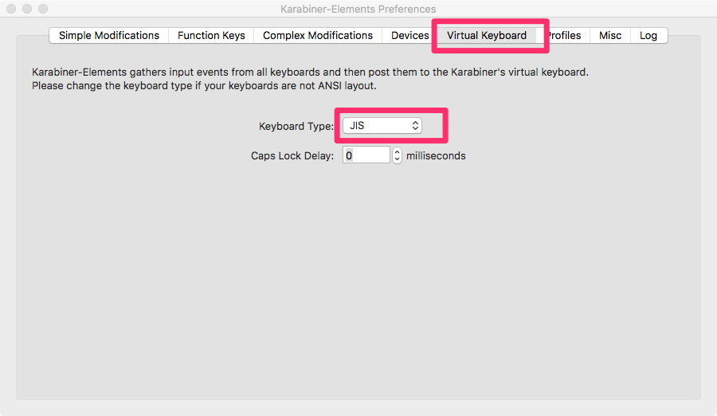
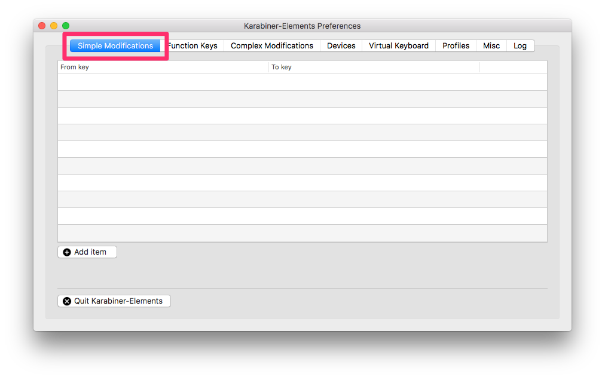
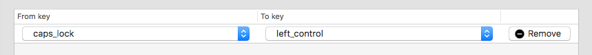
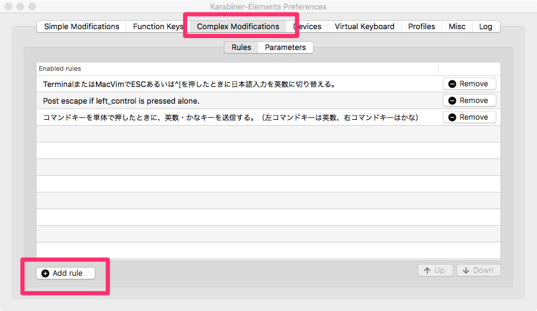
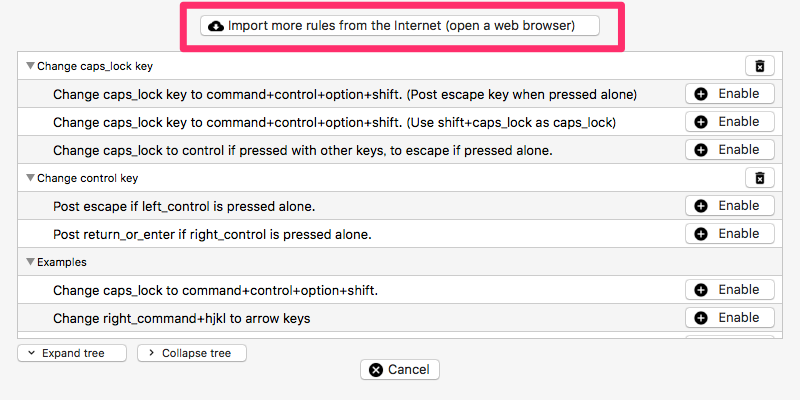
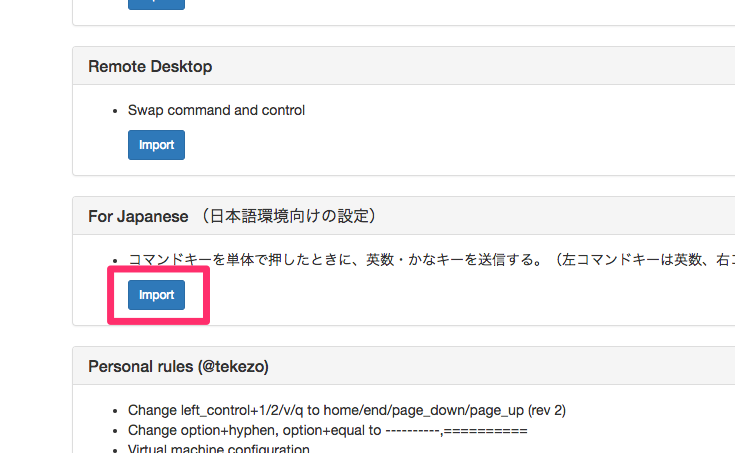
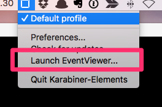

## Karabiner-Elementsとは

Karabiner-Elementsは、Macでキーボードをカスタマイズすることができる必須ツールです。
前まではKarabinerでしたが、Sierraから使えなくなったのでKarabiner-Elementsとして開発が進められています。
USキーであればほぼ必須のアプリです。

## ダウンロード
[https://github.com/tekezo/Karabiner-Elements]()


ダウンロード→[https://pqrs.org/latest/karabiner-elements-latest.dmg]()

## 簡単な使い方




最初にVirtual Keyboardでキーボードのタイプを設定します。
USキーボード（日本語が印字されていないキーボード）であればUSに設定。



Simple Modificationsでは、単独キーのキーマップを変更できます。



上記で、caps_lockを封印してコントロールキーを押したことになります。

## 便利な使い方



上記タブで複数キー設定のテンプレートが設定できます。
Add ruleをクリック。



import more rules frpm the Internetをクリックし、サイトにアクセスします。



Importをクリックすると設定をインポートすることができます。（上は例でFor Japanese）

### 設定ファイルをカスタマイズしアプリごとのキーバインド、複数キー設定をする

上記設定だけでは心もとないので、設定ファイルを編集して自分の好きなようにカスタマイズしましょう。

```json:title=/.config/karabiner/karabiner.json
{
    "global": {
        "check_for_updates_on_startup": true,
        "show_in_menu_bar": true,
        "show_profile_name_in_menu_bar": false
    },
    "profiles": [
        {
            "complex_modifications": {
                "parameters": {
                    "basic.to_if_alone_timeout_milliseconds": 1000
                },
                "rules": [
                    {
                        "description": "TerminalまたはMacVimでESCあるいは^[を押したときに日本語入力を英数に切り替える。",
                        "manipulators": [
                            {
                                "conditions": [
                                    {
                                        "bundle_identifiers": [
                                            "^com\\.apple\\.Terminal$",
                                            "^org\\.vim\\.",
                                            "^com\\.googlecode\\.iterm2$"
                                        ],
                                        "type": "frontmost_application_if"
                                    }
                                ],
                                "from": {
                                    "key_code": "caps_lock",
                                    "modifiers": {
                                        "optional": [
                                            "any"
                                        ]
                                    }
                                },
                                "to": [
                                    {
                                        "key_code": "japanese_eisuu"
                                    },
                                    {
                                        "key_code": "escape"
                                    },
                                    {
                                        "key_code": "left_control"
                                    }
                                ],
                                "type": "basic"
                            },
                            {
                                "conditions": [
                                    {
                                        "bundle_identifiers": [
                                            "^com\\.apple\\.Terminal$",
                                            "^org\\.vim\\.",
                                            "^com\\.googlecode\\.iterm2$"
                                        ],
                                        "type": "frontmost_application_if"
                                    }
                                ],
                                "from": {
                                    "key_code": "left_control",
                                    "modifiers": {
                                        "optional": [
                                            "any"
                                        ]
                                    }
                                },
                                "to": [
                                    {
                                        "key_code": "left_control"
                                    }
                                ],
                                "to_if_alone": [
                                    {
                                        "key_code": "japanese_eisuu"
                                    },
                                    {
                                        "key_code": "escape"
                                    },
                                    {
                                        "key_code": "left_control"
                                    }
                                ],
                                "type": "basic"
                            },
                            {
                                "conditions": [
                                    {
                                        "bundle_identifiers": [
                                            "^com\\.apple\\.Terminal$",
                                            "^org\\.vim\\.",
                                            "^com\\.googlecode\\.iterm2$"
                                        ],
                                        "type": "frontmost_application_if"
                                    }
                                ],
                                "from": {
                                    "key_code": "escape",
                                    "modifiers": {
                                        "optional": [
                                            "any"
                                        ]
                                    }
                                },
                                "to": [
                                    {
                                        "key_code": "japanese_eisuu"
                                    },
                                    {
                                        "key_code": "escape"
                                    }
                                ],
                                "type": "basic"
                            },
                            {
                                "conditions": [
                                    {
                                        "bundle_identifiers": [
                                            "^com\\.apple\\.Terminal$",
                                            "^org\\.vim\\.",
                                            "^com\\.googlecode\\.iterm2$"
                                        ],
                                        "type": "frontmost_application_if"
                                    }
                                ],
                                "from": {
                                    "key_code": "open_bracket",
                                    "modifiers": {
                                        "mandatory": [
                                            "left_control"
                                        ]
                                    }
                                },
                                "to": [
                                    {
                                        "key_code": "japanese_eisuu"
                                    },
                                    {
                                        "key_code": "escape"
                                    }
                                ],
                                "type": "basic"
                            }
                        ]
                    },
                    {
                        "description": "Change caps_lock to control if pressed with other keys, to escape if pressed alone.",
                        "manipulators": [
                            {
                                "from": {
                                    "key_code": "caps_lock",
                                    "modifiers": {
                                        "optional": [
                                            "any"
                                        ]
                                    }
                                },
                                "to": [
                                    {
                                        "key_code": "left_control"
                                    }
                                ],
                                "to_if_alone": [
                                    {
                                        "key_code": "escape"
                                    }
                                ],
                                "type": "basic"
                            }
                        ]
                    },
                    {
                        "description": "コマンドキーを単体で押したときに、英数・かなキーを送信する。（左コマンドキーは英数、右コマンドキーはかな）",
                        "manipulators": [
                            {
                                "from": {
                                    "key_code": "left_command",
                                    "modifiers": {
                                        "optional": [
                                            "any"
                                        ]
                                    }
                                },
                                "to": [
                                    {
                                        "key_code": "left_command"
                                    }
                                ],
                                "to_if_alone": [
                                    {
                                        "key_code": "japanese_eisuu"
                                    }
                                ],
                                "type": "basic"
                            },
                            {
                                "from": {
                                    "key_code": "right_command",
                                    "modifiers": {
                                        "optional": [
                                            "any"
                                        ]
                                    }
                                },
                                "to": [
                                    {
                                        "key_code": "right_command"
                                    }
                                ],
                                "to_if_alone": [
                                    {
                                        "key_code": "japanese_kana"
                                    }
                                ],
                                "type": "basic"
                            }
                        ]
                    }
                ]
            },
            "devices": [],
            "fn_function_keys": {
                "f1": "display_brightness_decrement",
                "f10": "mute",
                "f11": "volume_decrement",
                "f12": "volume_increment",
                "f2": "display_brightness_increment",
                "f3": "mission_control",
                "f4": "launchpad",
                "f5": "illumination_decrement",
                "f6": "illumination_increment",
                "f7": "rewind",
                "f8": "play_or_pause",
                "f9": "fastforward"
            },
            "name": "Default profile",
            "selected": true,
            "simple_modifications": {
                "caps_lock": "left_control"
            },
            "virtual_hid_keyboard": {
                "caps_lock_delay_milliseconds": 0,
                "keyboard_type": "ansi"
            }
        }
    ]
}

```

### 設定ファイルの解説

#### 指定したアプリ内でのみ動かす。
```json
                                "conditions": [
                                    {
                                        "bundle_identifiers": [
                                            "^com\\.apple\\.Terminal$",
                                            "^org\\.vim\\.",
                                            "^com\\.googlecode\\.iterm2$"
                                        ],
                                        "type": "frontmost_application_if"
                                    }
                                ],
```


上記はターミナル、vim、iterm2

bundle_identifierは、



から調べることができます。

#### 複数キーの設定

```json
                                "from": {
                                    "key_code": "right_command",
                                    "modifiers": {
                                        "optional": [
                                            "any"
                                        ]
                                    }
                                },
                                "to": [
                                    {
                                        "key_code": "right_command"
                                    }
                                ],
                                "to_if_alone": [
                                    {
                                        "key_code": "japanese_kana"
                                    }
                                ],
```
fromは最初に押されたキー、
toは次に押されたキー
to_if_aloneは最初に押されたキーが単独で押された場合に発動する設定

他にも設定はあるのでgithubなり設定をインポートしたjsonを見て参考にするといいと思います。

## 設定が反映されない場合
一旦Karabiner-Elementsを落とし、再度起動します。

## 終わりに
MBPをタッチバーにしてからescが使いづらくなってるので、現状caps lockを単独で押した場合escにしています。  
Karabiner-Elements is 神!!

### 参考リンク

Vimのキーバインドは下記を参考に少しカスタマイズしました。  
[TerminalやMacVimでEsc (or ^\[)キーで日本語IMEを英数に切り替える](http://qiita.com/takaeda/items/38ecf7d98d1a3ef99ef0)
