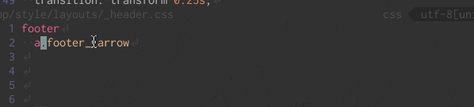

IntelliJ系IDEなどの統合開発環境にある便利機能に、コードジャンプという機能があります。  
関数や変数など、カーソルが当たっているところの定義元を参照してくれる、自分みたいな忘れっぽい人に便利な機能です。  
最近なんやかんやあってVimを使っているので、Vimでコードジャンプするための振り返りとしてまとめます。

Atomの場合は  

- [https://atom.io/packages/atom-ctags]()
- [https://atom.io/packages/goto-definition]()

Sublime Textの場合は

- List stylesheet variables(Sass変数リストアップ)
- Goto Definition(デフォルト機能)

で事足りると思いますが、Ctagsを利用することもできます。

- [https://github.com/SublimeText/CTags]()

VScodeの場合は

- [Ctags support](https://marketplace.visualstudio.com/items?itemName=jaydenlin.ctags-support)

## Ctagsとは

コードを解析してインデックスを貼ってくれる便利なやつです。  
関数や変数を解析して、あれはここで定義されてるよ〜ってのをやってくれるやつです。結構早い。  
2009年から更新されていないため、ここではUniversal Ctagsというものを使います。

### インストール

環境はMacです。  
Ctagsを既にインストールしている場合アンインストールします。

```
brew uninstall ctags
```
Homebrewでインストール。
```
brew tap universal-ctags/universal-ctags
brew uninstall ctags
```

以上でUniversal Ctagsのインストールは完了です。

## 使い方

プロジェクトのルートディレクトリで
```
ctags -R
```
を実行することにより、tagsというファイルが生成されます。  
これによりエディタ側でtagsファイルを解析し、コードジャンプすることができます。  
しかし、これはコマンドを打った時点でのインデックスなので、新しい関数なりを定義すると定義元を参照してくれません。

## Gitのフックを作って楽をする

最近知ったのですがGitにはフックという機能があり、それを用いるとコミットやプッシュなどを認識して処理を行うことができます。  
また、initやclone時にファイルが自動的に生成されるため、テンプレートとして用いることもできます。  
ここではテンプレートとして利用します。

```sh
git config --global init.templatedir '~/.git_template'
mkdir -p ~/.git_template/hooks
```
これでhooksというディレクトリが作られ、今後.gitディレクトリに配置されます。  
hooks内にファイルを置き、使いまわすことを前提としているため、ここにctagsというシェルコマンドのファイルを作成します。

```
#!/usr/bin/env bash
set -e
PATH="$HOME/local/bin:/usr/local/bin:$PATH"
cd "$(dirname "${BASH_SOURCE:-$0}")"; cd ../../
trap "rm -f .git/tags.$$" EXIT
ctags --tag-relative=yes -R -f .git/tags.$$
mv .git/tags.$$ .git/tags
```

上記ファイルに実行権限を与え、実行できるようにします。
```
chmod 755 ctags
```

ファイルは[GitのhookでCtagsを実行する](https://tmsanrinsha.net/post/2014/04/git-hook-ctags/)の記事を参考にUniversal Ctagsに対応するようにしています。

## .ctagsファイルでカスタマイズ

~/.ctagsというファイルを作成することによって、グローバルでカスタマイズ・設定ができます。

```

--langdef=js
--langmap=js:.js
--langmap=js:+.jsx

--regex-JavaScript=/([A-Za-z0-9._$\(\)]+)[ \t]*[:=][ \t]*function[ \t]*\(/\1/m,method/
--regex-JavaScript=/([A-Za-z0-9._$\#\(\)]+)[ \t]*[:][ \t]*([A-Za-z0-9._\-\#\'\"]+)[ \t]*/\1/p,property/
--regex-JavaScript=/([A-Za-z0-9._$\#\(\)]+)[ \t]*[:][ \t]*([A-Za-z0-9\'\"._\-\#\(]+)[ \t]*\{/\1/p,property/
--regex-JavaScript=/var ([A-Za-z0-9._$\#]+)[ \t]*[=][ \t]*([A-Za-z0-9._'"\$\#\[\{]+)[,|;]/\1/v,variable/
--regex-JavaScript=/([A-Za-z0-9._$\#]+)[ \t]*[=][ \t]*([A-Za-z0-9._'"\$\#]+)extend\(/\1/c,class/

--regex-ruby=/(^|[:;])[ \t]*([A-Z][[:alnum:]_]+) *=/\2/c,class,constant/
--regex-ruby=/(^|;)[ \t]*(has_many|belongs_to|has_one|has_and_belongs_to_many)\(? *:([[:alnum:]_]+)/\3/f,function,association/
--regex-ruby=/(^|;)[ \t]*(named_)?scope\(? *:([[:alnum:]_]+)/\3/f,function,named_scope/
--regex-ruby=/(^|;)[ \t]*expose\(? *:([[:alnum:]_]+)/\2/f,function,exposure/
--regex-ruby=/(^|;)[ \t]*event\(? *:([[:alnum:]_]+)/\2/f,function,aasm_event/
--regex-ruby=/(^|;)[ \t]*event\(? *:([[:alnum:]_]+)/\2!/f,function,aasm_event/
--regex-ruby=/(^|;)[ \t]*event\(? *:([[:alnum:]_]+)/\2?/f,function,aasm_event/

--langdef=markdown
--langmap=markdown:.md.markdown.mdown.mkd.mkdn
--regex-markdown=/^#[ \t]+(.*)/\1/h,heading1/
--regex-markdown=/^##[ \t]+(.*)/\1/h,heading2/
--regex-markdown=/^###[ \t]+(.*)/\1/h,heading3/

--langdef=coffee
--langmap=coffee:.coffee
--regex-coffee=/^[ \t]*([A-Za-z.]+)[ \t]+=.*->.*$/\1/f,function/
--regex-coffee=/^[ \t]*([A-Za-z.]+)[ \t]+=[^->\n]*$/\1/v,variable/

--langdef=css
--langmap=css:.css
--langmap=css:+.scss
--langmap=css:+.sass
--langmap=css:+.styl
--langmap=css:+.less
--regex-css=/^[ \t]*(([A-Za-z0-9_-]+[ \t\n,]+)+)\{/\1/t,tag,tags/
--regex-css=/^[ \t]*#([A-Za-z0-9_-]+)/#\1/i,id,ids/
--regex-css=/^[ \t]*\.([A-Za-z0-9_-]+)/.\1/c,class,classes/

--langdef=SCSS
--langmap=SCSS:.scss
--regex-SCSS=/^\s*\$([a-zA-Z_][a-zA-Z0-9_]+)/\1/d,var/

--langdef=less
--langmap=less:.less
--regex-less=/^[ t]*.([A-Za-z0-9_-]+)/1/c,class,classes/
--regex-less=/^[ t]*#([A-Za-z0-9_-]+)/1/i,id,ids/
--regex-less=/^[ t]*(([A-Za-z0-9_-]+[ tn,]+)+){/1/t,tag,tags/
--regex-less=/^[ t]*@medias+([A-Za-z0-9_-]+)/1/m,media,medias/

--exclude=node_modules
--exclude=dist
--exclude=.git
--exclude=.session.vim
--exclude=package.json
--exclude=webpack.config.babel.js
--exclude=postcss.config.js
--exclude=yarn.lock
--exclude=config.js
```

## Vimとの連携

tpope/vim-fugitiveをインストールすることにより、.git/tagsを参照してくれます。

.vimrcに下記を記述し、Vimでファイルが保存されたら.git/hooks/ctagsコマンドを実行するようにします。
```vim
autocmd BufWritePost *
      \ if exists('b:git_dir') && !empty(glob(b:git_dir.'/hooks/ctags')) |
      \   call system('"'.b:git_dir.'/hooks/ctags"') |
      \ endif
```

Vimを開いていたら再起動し、定義元に飛びたい箇所にカーソルを合わせるか選択し、  
ctrl+] でジャンプ  

定義元ファイルから戻る場合は  
crtl+t で戻ることができます。(変更した後は戻れないので、ctrl+oで戻る)



## 改善点

pugで.testみたいなクラスでctrl+]打ってもドットまで読んでくれないため、選択しなくちゃならないのが面倒くさい。  
node_modulesで指定したものだけincludeしたいんだけど今のところできていない。  
deniteでリストを出したい。

とりあえず楽になったのでOK！

---

### 参考リンク  

- [universal-ctags で Vim からのコード参照を楽にする](http://mizukmb.hatenablog.com/entry/2016/05/04/082739)
- [GitのhookでCtagsを実行する](https://tmsanrinsha.net/post/2014/04/git-hook-ctags/)
