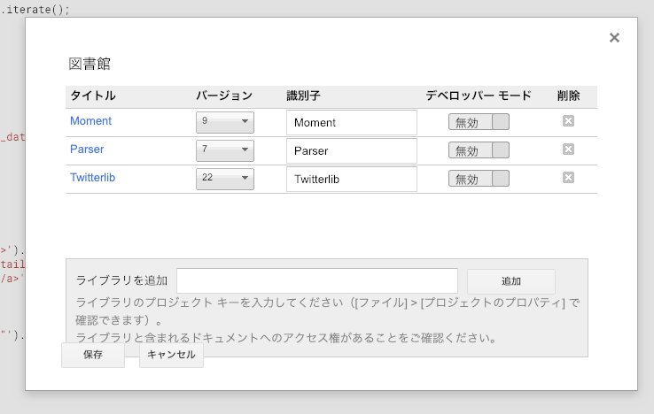
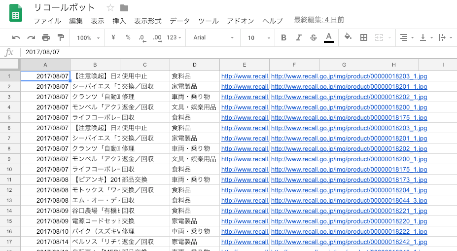

<!-- wp:paragraph -->

2017年にストーブが爆発してからリコールというものに敏感になりました。 しかしながらリコールの情報元となるサイトが旧式のもので、RSSはおろかTwitterでの情報配信もしていなかったのでサクッとGASで作成してみました。 今だったらclaspを使うところですがそんなものは2017年にはなかったのでご了承下さい。 コードを利用、悪用して何があってもこちらは責任取れませんのでそこらへんよろしくお願いします。  

<!-- /wp:paragraph -->

抜き出し元：<a href="http://www.recall.go.jp/new/" target="_blank">消費者庁のリコール情報サイト</a>

<!-- wp:paragraph -->

ソースコード <a href="https://gist.github.com/tanshio/7d15486f44960a738805ce60122308e4" target="_blank">https://gist.github.com/tanshio/7d15486f44960a738805ce60122308e4</a>

<!-- /wp:paragraph -->

<!-- wp:heading -->
## 解説
<!-- /wp:heading -->

<!-- wp:paragraph -->

GASでスクレイピングして、そのままTwitterに流しているだけです。 新規のものがない、2P目まで行ったらメールするようにしています。(2P目以降は飽きたので処理していません) 日付トリガーで19時ぐらいに毎日処理するようにしています。

<!-- /wp:paragraph -->

<!-- wp:code -->
<pre class="wp-block-code"><code>  var twitterKeys= {
    TWITTER_CONSUMER_KEY: "TWITTER_CONSUMER_KEY",
    TWITTER_CONSUMER_SECRET: "TWITTER_CONSUMER_SECRET",
    TWITTER_ACCESS_TOKEN: "TWITTER_ACCESS_TOKEN",
    TWITTER_ACCESS_SECRET: "TWITTER_ACCESS_SECRET"    
  };</code></pre>
<!-- /wp:code -->

<!-- wp:paragraph -->

上記箇所は各々変更して下さい。

<!-- /wp:paragraph -->

<!-- wp:heading -->
## ライブラリ
<!-- /wp:heading -->

<!-- wp:paragraph -->

GASにはライブラリという機能があるのですが、上の3つを追加することで非常に効率的に開発ができました。 

<!-- /wp:paragraph -->

<!-- wp:list -->
<ul><li>Moment→おなじみ日付処理</li><li>Parser→HTMLをパースするライブラリ。SheetのimportXMLが効かない場合はこれが便利。</li><li>Twitterlib→Twitterに流すもの。画像が流せるのが非常に便利</li></ul>
<!-- /wp:list -->

シートにはこんな感じで貯まっていきます。

## 作ったアカウント

<a href="https://twitter.com/recall_bot_" target="_blank">リコールbot</a>

毎日安定運用しているので、GASはRSS吐いていないサイトを巡回する場合非常に便利！

## おわりに

機械学習や統計とかのデータに使えそうだなと思って1年間放置していましたが、結局2018年は忙しすぎて何もできないままでした。自分の時間を増やして新しいことをどんどんやっていきたいです。
