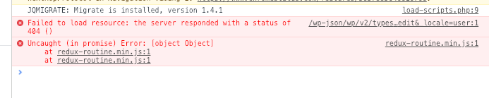

<!-- wp:paragraph -->このブログを1年ぶりぐらいに更新しようとして、WPのバージョンアップをし、Gutenbergで投稿しようとしたら保存できなくてハマったのでメモします。



```php
    function delete_API_data( $data, $item, $request ) {
      $list = ['guid','status','type','expert','author','comment_status','ping_status','sticky','format','meta','_links','excerpt','categories',
    'tags','template','featured_media'];
    
      foreach ($list as $item) {
        unset($data->data[$item]);
      }
    
      // unset($data->data["_links"]);
      return $data;
    }
    
    add_filter( 'rest_prepare_post', 'delete_API_data', 10, 3 );
```
上記のように、必要ないと思っていたデータを削除しまくっていたのが原因でした。  
Gutenberg内でもWP REST APIを使用しているため、影響をモロにくらった形です。  
データを整形したければ、自作エンドポイントを使うのがベターなようです。
