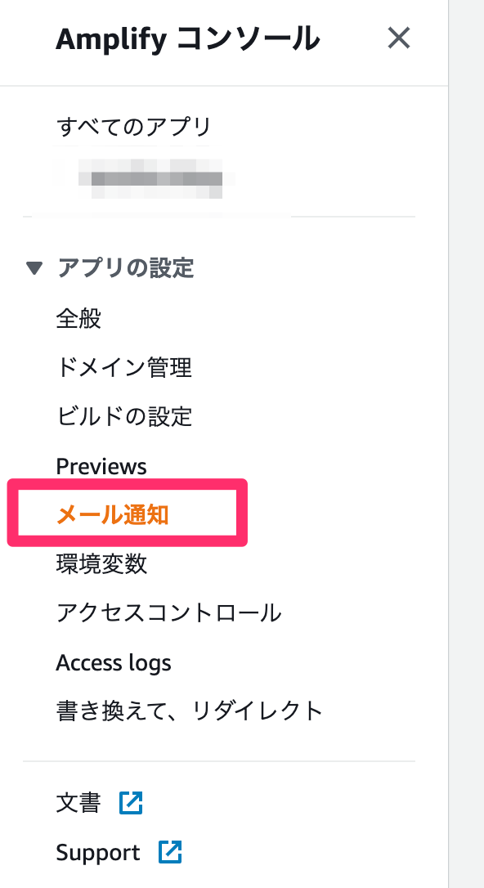
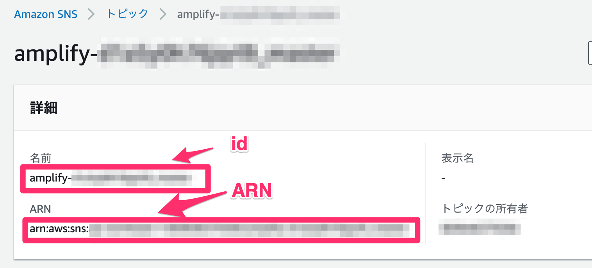
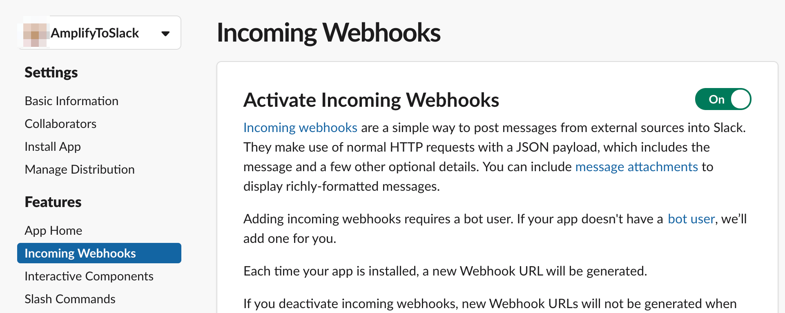
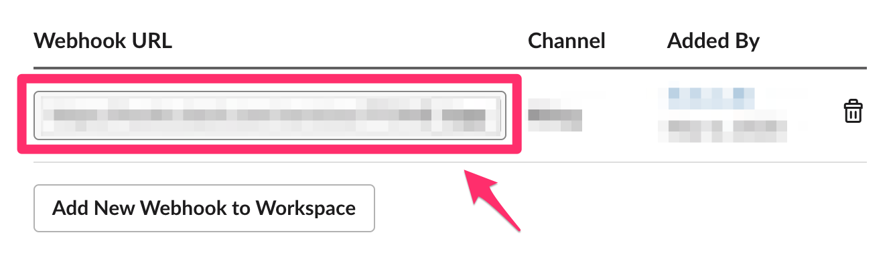
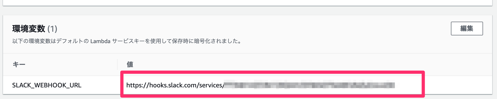
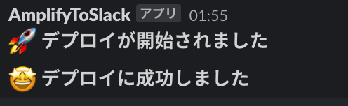

最近主に何も考えずにデプロイできる Amplify Console でサイト作成したりアプリ作成したりしているのですが、AWS CDK を使うとサクッと Lambda との連携ができたのでメモしておきます。

## AWS CDK とは

AWSの魔境である CloudFormation をラップし、TypeScript や Python で環境構築できる非常に便利なツールです。

AWS の基礎力は必要ですが、GUIでポチポチやったり、つよつよにならない限りハードルが高いCloudFormation ではなくコードベースで環境がサクッと構築できますのでおすすめです。

導入も比較的簡単なので、おなじみクラスメソッドさんの [【コードでインフラ定義】CDKという異次元体験をさくっとやるのに便利なAWS公式Workshopの紹介](https://dev.classmethod.jp/cloud/aws/cdk-workshop-typescript/) で試してみてください。

## Amplify Console で 通知の設定をする

<p style="max-width: 250px">

</p>

AWS にログインして、メール通知→ Manage notifications から一旦とりあえずメールを設定します。  
これでビルド開始・終了でメールが届くようになります。

## AWS SNS の情報を控える



AWS SNS の画面で、Amplify で作成されたIDとARNを控えます。

## Slack の設定



Slack App を作成して Incoming Web hook をオンにして URL を発行してください。



ウェブフックの URL も後で使うので控えておきます。

## CDK で Lambda を作成しデプロイする

とりあえずコードはここです。  
https://github.com/tanshio/amplify-sns-to-slack

クローンしたところと、`src/lambda/amplify/` で `yarn install` でインストール、  
`direnv` を使っているので、`.envrc.template` を `.envrc` にリネームして、 `direnv allow` で環境変数を有効化します。

AMPLIFY\_SNS\_ID が SNS の ID です  
AMPLIFY\_SNS\_ARN が SNS の ARN です

### 簡単なコードの解説（Stack）

ローカルの環境変数を読み込んでファイルを生成するように設定しています。

```ts:title=/lib/amplify-slack-stack.ts
import * as cdk from '@aws-cdk/core'
import * as lambda from '@aws-cdk/aws-lambda'

import sns = require('@aws-cdk/aws-sns')
import subs = require('@aws-cdk/aws-sns-subscriptions')

export class AmplifySlackStack extends cdk.Stack {
  constructor(scope: cdk.Construct, id: string, props?: cdk.StackProps) {
    super(scope, id, props)

    const topic = sns.Topic.fromTopicArn(
      this,
      process.env.AMPLIFY_SNS_ID || '',
      process.env.AMPLIFY_SNS_ARN || '',
    )

    // The code that defines your stack goes here
    const myFunction = new lambda.Function(this, 'amplify-2020-03-02-slack', {
      functionName: 'amplify-2020-03-02-slack',
      runtime: lambda.Runtime.NODEJS_10_X,
      handler: 'index.handler',
      code: new lambda.AssetCode('src/lambda/amplify'),
    })

    topic.addSubscription(new subs.LambdaSubscription(myFunction))
  }
}
```

`new lambda.AssetCode('src/lambda/amplify')` の部分がミソで、これを使うことにより `src/lambda/amplify` ディレクトリをそのまま固めることができます。

`lambda.AssetCode.fromAsset(ファイル名)` だと `node_modules` が除外されてしまうので、今回みたいな軽いlambdaであれば `new lambda.AssetCode` でいいんじゃないかと思います。サイズが大きくなったら Lambda Layer を使用したほうが良いと思います。

### 簡単なコードの解説（Lambda）

```ts:title=/src/lambda/amplify/index.ts
import axios from 'axios'

const PREFIX = `Your build status is`
const STATUSES = ['STARTED', 'SUCCEED', 'FAILED'] as const
type StatusType = typeof STATUSES[number]

type messageType = {
  [k in StatusType]: any
}

const createSlackMessage = (msg: string): any => {
  return [
    {
      type: 'section',
      text: {
        type: 'mrkdwn',
        text: msg,
      },
    },
  ]
}

const slackMessages: messageType = {
  STARTED: `🚀 *デプロイが開始されました*`,
  SUCCEED: `🤩 *デプロイに成功しました*`,
  FAILED: `🤬 *デプロイに失敗しました*`,
}

export async function handler(event: any) {
  const message = event.Records[0]['Sns']['Message']
  const status =
    STATUSES.find((s) => {
      return `${PREFIX}${message}`.includes(s)
    }) || 'FAILED'

  await axios.post(process.env.SLACK_WEBHOOK_URL || '', {
    text: slackMessages[status],
    // Block Kit Builderを参考にする https://api.slack.com/tools/block-kit-builder
    blocks: createSlackMessage(slackMessages[status]),
  })

  return
}
```

`event.Records[0]['Sns']['Message']` に Amplify Console から届くメール文が入っていますので、ここに指定の文字が入っているかをチェックして、それに応じてメッセージを作ります。それを axios で ウェブフックの URL に POST しているだけの単純な Lambda です。

### CDK のデプロイ

`cdk deploy` でLambda をデプロイ。

### Lambda の 環境変数



Lambda のページに行って、作成された Lambda に環境変数 `SLACK_WEBHOOK_URL` をセットします。

後は Amplify で再ビルドなどしてみてください。

<p style="max-width: 250px">

</p>

Slack に通知がいきました！

あとは Amplify の通知から必要なければメールを削除してください。

## おわりに

Slack に通知が行くのは体験がいいのでおすすめです。  
CDK も 環境がサクッと作成できるのでぜひ触ってみてください。
