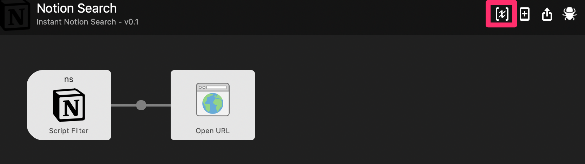

全部入りノートとしてデファクトになりつつあるNotion。  
色々癖がありつつも便利すぎてこれなしだと何もできなくなってしまいました。

Notionで唯一気になっていたことがAlfredから呼べないことでした。  
探してみたらWorkflowはあったのですが、そのままではアプリは呼べなかったのでメモしておきます。

※以下は macとAlfredの有料プラン持っていない人には意味のないものになります。

## Alfred とNotion との連携

### notion-search-alfred-workflow をインストール
https://github.com/wrjlewis/notion-search-alfred-workflow

上のURLから、 Download の見出しの下にある URL から Workflow をインストールします

### 変数の設定

Obtaining your workflow variables の見出しの下の設定をします。  
Alfred workflow から検索したい Notion のワークスペースをブラウザから開き、 `quick find` のページで何でもいいので検索します。  
Chrome などの開発者ツールで、 Network → search のページの Header から `cookie` と Request Payload の `spaceId` をメモします。 



インストールした Alfred workflow で、変数 `cookie` と `notionSpaceId` を設定します。

これでAlfredを起動し、 `ns` と打つと Notion の検索結果が出ます。  
このままだとブラウザでドカドカ開くことになってしまうので次にアプリで開くようにします。

## アプリから開く
インストールした Alfred workflow の Notionアイコンをクリックし、スクリプトを編集します。

コードの123番目の `searchResultObject.link` で Notion のURL を設定している部分を、Notion のURLスキームに変更します。

```
searchResultObject.link = "notion://www.notion.so/" + 〜〜〜
```

以上でAlfred から `ns` で検索するとNotionアプリで開くようになります。

## 終わりに

Alfred workflow が Cookie 使っていたりするので、有効期限でいちいち設定し直すことが必要になりそう。なんにせよ自己責任でお願いします。  
いまのところ1つのワークスペース内でしか検索できないので、NotionのAPIができたらもっと柔軟になりそう。 API 来たらモダンなノートアプリは Notion の独壇場になりそうですね。
